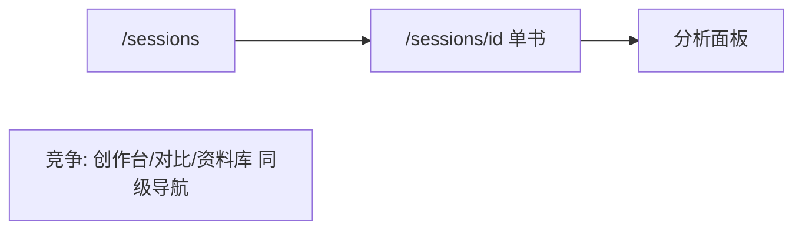

# Phase 1: 体验审计与功能矩阵 — Pattern Map

**Mapped:** 2026-05-26  
**Files analyzed:** 5 deliverables (+ 1 optional)  
**Analogs found:** 5 / 5

## File Classification

| New/Modified File | Role | Data Flow | Closest Analog | Match Quality |
|-------------------|------|-----------|----------------|---------------|
| `01-FEATURE-MATRIX.md` | doc / inventory | transform (codebase → matrix) | `.planning/phases/01-ux-audit-matrix/01-RESEARCH.md` § Verified Route Inventory | exact |
| `01-UI-REVIEW.md` | doc / audit report | transform (static + optional browser → scores) | `.cursor/agents/gsd-ui-auditor.md` `<output_format>` | exact |
| `01-AUDIT-BACKLOG.md` | doc / backlog | transform (findings → prioritized rows) | `.planning/codebase/CONCERNS.md` + `verification-report.md` Anti-Patterns | role-match |
| `01-USER-JOURNEYS.md` (optional) | doc / diagram | transform | `01-RESEARCH.md` Mermaid skeleton + `.planning/codebase/ARCHITECTURE.md` | partial (prefer embed in matrix per D-22) |
| `.planning/ui-reviews/.gitignore` | config | file-I/O (screenshot gate) | `gsd-ui-auditor.md` `<gitignore_gate>` | exact |

**Out of scope for this phase:** Any `src/**` edits; `01-PATTERNS.md` (this file) is planner input only.

---

## Pattern Assignments

### `01-FEATURE-MATRIX.md` (doc/inventory, transform)

**Analog:** `.planning/phases/01-ux-audit-matrix/01-RESEARCH.md` (inventory + templates) + `.planning/codebase/STRUCTURE.md` (API surface list)

**Document header pattern** (mirror RESEARCH / codebase maps):

```markdown
# Phase 1: 全站功能矩阵

**Audited:** 2026-05-26
**Scope:** `(app)` routes, API capability clusters, Server Actions (D-01)
**Inputs:** `src/app/**`, `app-nav.tsx`, `01-CONTEXT.md` D-02/D-08
```

**Route inventory table pattern** (lines 176–197 in `01-RESEARCH.md` — extend into AUD-01 columns):

```markdown
| File path | URL pattern | Notes |
|-----------|-------------|-------|
| `src/app/(app)/sessions/page.tsx` | `/sessions` | P0; dual CTA to `/upload?mode=dual` |
| `src/app/(app)/dashboard/page.tsx` | `/dashboard` | Edge: `redirect("/sessions")` |
```

**API clustering pattern** (lines 199–209 in `01-RESEARCH.md` — one matrix row per cluster, not per `route.ts`):

```markdown
| Capability cluster | Routes | Matrix row hint |
|--------------------|--------|-----------------|
| Blueprint | `blueprint`, `blueprint/confirm`, `blueprint/unconfirm` | 主路径 confirm 门禁 |
| Generate | `generate-v2` (hero), `generate`, ... | v2 主路径；legacy 边缘 |
```

**Matrix row template** (lines 394–400 in `01-RESEARCH.md` — add D-08 客观信号 column):

```markdown
| 路由/入口 | 用户目标 | 与双书主路径关系 | 频率 | 关键依赖 | 客观信号 | 备注 |
|-----------|----------|------------------|------|----------|----------|------|
| /sessions | 查看并进入双书项目 | 主 | 高 | — | sidebar 顶栏；登录后 1 步 | 列表 CTA 链向 /upload?mode=dual |
```

**IA objective signals — copy from code** (`src/components/app-nav.tsx` lines 21–32):

```typescript
const NAV_ITEMS: NavItem[] = [
  { href: "/sessions", label: "项目", icon: FolderKanban },
  { href: "/studio", label: "创作台", icon: Sparkles },
  { href: "/compare", label: "对比", icon: GitCompare },
  { href: "/library", label: "资料库", icon: LibraryBig },
];
export const APP_NAV_ITEMS: NavItem[] = [...NAV_ITEMS, ...FOOTER_ITEMS];
```

Use in 客观信号: four peer sidebar items + settings footer; cite `APP_NAV_ITEMS` for D-21 “竞争注意力”.

**Edge / redirect rows** (`src/app/(app)/dashboard/page.tsx` lines 1–5):

```typescript
export default function DashboardPage() {
  redirect("/sessions");
}
```

```typescript
// src/app/(app)/sessions/archived/page.tsx
export default function ArchivedSessionsPage() {
  redirect("/library");
}
```

Matrix 备注: redirect target, classify 边缘 (D-07).

**API surface anchor** (`.planning/codebase/STRUCTURE.md` lines 90–96):

```markdown
**API Surface (`src/app/api/`):**
- `analyze/route.ts`, `analyze/extended/route.ts`, ...
- `generate/route.ts`, `generate-v2/route.ts`, ...
- `blueprint/route.ts`, `blueprint/confirm/route.ts`, ...
```

**Mermaid main journey** (lines 402–413 in `01-RESEARCH.md` — embed as `## 用户旅程` section, add 痛点占位 from audit only):


**Enumeration commands** (RESEARCH Pattern 1, lines 225–235):

```powershell
Get-ChildItem -Path src/app -Recurse -Filter page.tsx | ForEach-Object { $_.FullName }
Get-ChildItem -Path src/app/api -Recurse -Filter route.ts | ForEach-Object { $_.FullName }
```

**Flow-type row** (D-03): single row for upload/create with deps `src/lib/upload/actions.ts` + analyze/generate cluster — do not duplicate `/create` and `/upload` as separate API rows.

---

### `01-UI-REVIEW.md` (doc/audit, transform)

**Analog:** `.cursor/agents/gsd-ui-auditor.md` `<output_format>` (lines 328–384)

**Mandatory structure** (copy shell verbatim; adapt baseline line):

```markdown
# Phase 1 — UI Review

**Audited:** {date}
**Baseline:** abstract 6-pillar standards (no UI-SPEC.md; Phase 1 pre-design)
**Screenshots:** {captured / not captured}
**Scoring scope:** P0 routes only for pillar averages (D-13); P1/P2 → backlog

---

## Pillar Scores

| Pillar | Score | Key Finding |
|--------|-------|-------------|
| 1. Copywriting | {1-4}/4 | {one-line summary} |
...
**Overall: {total}/24**  <!-- P0 files only -->

## Top 3 Priority Fixes
...

## Detailed Findings
### Pillar 1: Copywriting ({score}/4)
{findings with file:line references}

## Files Audited
{P0 list + P1 list; note P2 spot-check only}
```

**Phase 1 deviations from stock ui-auditor:**

| Stock behavior | Phase 1 override | Source |
|----------------|------------------|--------|
| Requires `*-SUMMARY.md` | Skip orchestrator; spawn auditor directly | `01-RESEARCH.md` Pitfall 1 |
| Score all implemented UI | P0 full pillars; P1 findings → backlog; P2 checklist only | `01-CONTEXT.md` D-09–D-11 |
| `/design-system` in average | Appendix section; **excluded** from Overall /24 | D-12 |
| Full e2e smoke | Light P0 browser only (headings/skeleton) | D-14; anti `tests/e2e/smoke.spec.ts` |

**P0 file list** (from RESEARCH lines 245–248):

- `src/app/(app)/sessions/page.tsx`, `src/app/(app)/sessions/SessionsClient.tsx`
- `src/app/(app)/sessions/[id]/page.tsx`
- `src/app/(app)/sessions/[id]/workbench/page.tsx`, `workbench-client.tsx`

**Six-pillar grep methods** (`gsd-ui-auditor.md` lines 187–266):

```bash
grep -rn "Submit\|Click Here\|OK\|Cancel\|Save" src --include="*.tsx"
grep -rohn "text-\(xs\|sm\|base\|lg\|xl\|2xl\|3xl\|4xl\|5xl\)" src --include="*.tsx" | sort -u
grep -rn "\[.*px\]\|\[.*rem\]" src --include="*.tsx"
grep -rn "loading\|isLoading\|pending\|skeleton" src --include="*.tsx"
```

**Static density evidence** (RESEARCH lines 363–368):

```bash
rg -n "surface-panel" "src/app/(app)/sessions/[id]/workbench/workbench-client.tsx"
wc -l "src/app/(app)/sessions/[id]/workbench/workbench-client.tsx"
```

Flag ≥500 lines; workbench ~1361 → P0 density finding.

**Adversarial classification** (lines 33–36 in `gsd-ui-auditor.md`):

```markdown
- **BLOCKER** — pillar score 1 or task-breaking defect
- **WARNING** — pillar 2–3 or quality degradation
```

Map to backlog: BLOCKER → `P0`; WARNING → `P1`/`P2` by route tier (RESEARCH Pattern 5).

**Appendix: Design System** (D-12) — separate `## Appendix: /design-system` after Detailed Findings; reference `CONCERNS.md` lines 77–80 for prod exposure risk; no pillar score.

---

### `01-AUDIT-BACKLOG.md` (doc/backlog, transform)

**Analog:** `.planning/codebase/CONCERNS.md` (narrative + Files/Impact) + `.cursor/get-shit-done/templates/verification-report.md` (tabular severity)

**Document header:**

```markdown
# Phase 1: 审计 Backlog

**Synthesized:** {date}
**Sources:** `01-UI-REVIEW.md`, `01-FEATURE-MATRIX.md`, static/code walk, optional P0 smoke
**Dedupe key:** `lower(route)|pillar|normalize(现象)` (RESEARCH Pattern 5)
```

**Required row columns** (D-18 in `01-CONTEXT.md`):

```markdown
| severity | route/file | pillar或类别 | 现象 | 建议方向 |
|----------|------------|--------------|------|----------|
| P0 | `/sessions/[id]/workbench` | Spacing | ... | ... |
```

Severity values: `P0` | `P1` | `P2` | `P3` (Deferred) — not ui-auditor BLOCKER/WARNING in final doc (map at synthesis).

**Top 15 summary section** (D-15) — place after intro, before full table:

```markdown
## Top 15（摘要）

| # | severity | route/file | 现象（一句话） |
|---|----------|------------|----------------|
| 1 | P0 | ... | ... |
```

**CONCERNS-style deep row** (lines 7–11 in `CONCERNS.md`) — use in 备注 or long-form appendix for tech-debt items (CNV-*, legacy API):

```markdown
**Dual generation API surface (legacy vs blueprint):**
- Issue: Two parallel generation paths coexist...
- Files: `src/app/api/generate/route.ts`, `src/app/api/generate-v2/route.ts`, ...
- Impact: ...
```

**Anti-patterns table pattern** (`verification-report.md` lines 65–71):

```markdown
| File | Line | Pattern | Severity | Impact |
|------|------|---------|----------|--------|
| `workbench-client.tsx` | 120 | multiple `surface-panel` same step | P0 | 主路径密度 |
```

**Merge duplicate P1 findings** (D-21 discretion):

```markdown
| P1 | `/studio`, `/compare`, `/library` | Typography | 同屏字号阶梯 >4 | 统一 token（Phase 2） |
```

Single row with `affected_routes` in 备注 instead of three identical rows.

**Deferred / P3 bucket** — end of file:

```markdown
## Deferred (P3 — 本里程碑不实施)

| route/file | 类别 | 现象 | 来源 |
|------------|------|------|------|
| `/design-system` | Security | 生产环境无 NODE_ENV guard | CONCERNS.md |
| `/api/generate` | Tech debt | legacy 单书入口 | CNV-01 |
```

---

### `01-USER-JOURNEYS.md` (optional doc/diagram, transform)

**Analog:** `01-RESEARCH.md` Mermaid (lines 402–413) + `.planning/codebase/ARCHITECTURE.md` dual-book flow (lines 95+)

**Planner default (D-22):** Prefer `## 用户旅程` section inside `01-FEATURE-MATRIX.md` rather than a fourth file.

If separate file, use same frontmatter style as matrix:

```markdown
# Phase 1: 用户旅程（附图）

**Main path:** 双书蓝图（见 FEATURE-MATRIX 主图）
```

**附图 pattern** (D-21) — ≤8 steps each, `flowchart LR`, note 竞争注意力 at nav peers:



---

### `.planning/ui-reviews/.gitignore` (config, file-I/O)

**Analog:** `gsd-ui-auditor.md` `<gitignore_gate>` (lines 74–91)

**Pattern** (run before any P0 screenshot):

```bash
mkdir -p .planning/ui-reviews
# Write .gitignore if not present — *.png, *.webp, ...
```

Not part of D-19 三件套; create during plan 01-02 browser wave if screenshots used.

---

## Shared Patterns

### Chinese prose + English paths

**Source:** `01-CONTEXT.md` D-19  
**Apply to:** All three deliverables  

正文中文；`route/file`、API、`src/...` 路径保持英文。

### Delta on codebase maps (do not re-map repo)

**Source:** `01-CONTEXT.md` code_context + `.planning/codebase/*`  
**Apply to:** `01-FEATURE-MATRIX.md`  

引用 `STRUCTURE.md` / `ARCHITECTURE.md` / `CONCERNS.md` 已有事实；矩阵只补 **UI/路由 delta** 与 AUD 列。

### Tiered audit routing (P0 / P1 / P2 / Appendix)

**Source:** `01-RESEARCH.md` Pattern 2 (lines 239–248)  
**Apply to:** `01-UI-REVIEW.md`, `01-AUDIT-BACKLOG.md`

| Tier | Routes | Depth | Feeds |
|------|--------|-------|-------|
| P0 | `/sessions`, `/sessions/[id]`, `/sessions/[id]/workbench` | Full 6 pillars + Overall /24 | UI-REVIEW scores |
| P1 | `/studio`, `/compare`, `/library`, `/settings` | Full pass → backlog | Backlog P1 |
| P2 | `/create`, `/upload`, studio subroutes, archived | Spot-check | Backlog P2 |
| Appendix | `/design-system` | Token reference + risk | Backlog P3 |

### Regression gate (no new tests)

**Source:** `01-CONTEXT.md` — `npm test` only  
**Apply to:** All plan waves after doc writes  

```bash
npm test
```

Do **not** run `npm run test:e2e` / full `smoke.spec.ts` for Phase 1 evidence.

### Direct `gsd-ui-auditor` spawn (not `/gsd-ui-review`)

**Source:** `.cursor/get-shit-done/workflows/ui-review.md` lines 56–57 + `01-RESEARCH.md` Pitfall 1  

```markdown
**If `SUMMARY_FILES` empty:** Exit — "Phase {N} not executed."
```

Plan 01-02 must pass `<files_to_read>` = CONTEXT + P0/P1 paths; output path `01-UI-REVIEW.md`.

---

## No Analog Found

| File | Role | Data Flow | Reason |
|------|------|-----------|--------|
| — | — | — | All Phase 1 deliverables have in-repo analogs |

**Note:** No prior `*-UI-REVIEW.md` or `*-FEATURE-MATRIX.md` exists in `.planning/phases/`; brownfield templates are **methodology + codebase maps**, not copy-paste prior phase artifacts.

---

## Metadata

**Analog search scope:** `.planning/phases/01-ux-audit-matrix/`, `.planning/codebase/`, `.cursor/agents/gsd-ui-auditor.md`, `.cursor/get-shit-done/workflows/ui-review.md`, `.cursor/get-shit-done/templates/verification-report.md`, `src/components/app-nav.tsx`, redirect pages under `src/app/(app)/`  
**Files scanned:** 12  
**Pattern extraction date:** 2026-05-26
