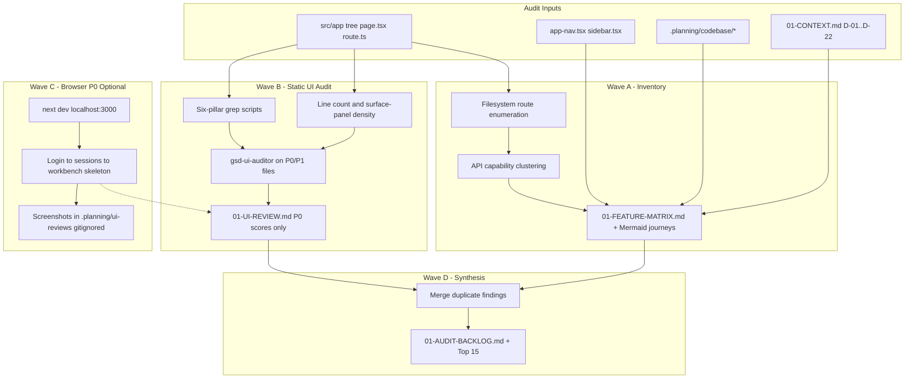
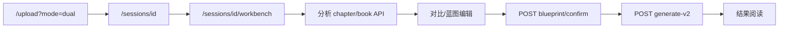

# Phase 1: 体验审计与功能矩阵 — Research

**Researched:** 2026-05-26  
**Domain:** Brownfield UX audit (Next.js 15 App Router + doc-only deliverables)  
**Confidence:** HIGH (codebase-verified inventory); MEDIUM (execution sequencing & browser smoke boundaries)

<user_constraints>
## User Constraints (from CONTEXT.md)

### Locked Decisions

#### 功能矩阵粒度与列（AUD-01）
- **D-01:** 矩阵粒度 = **用户可感知入口 + 关键服务端路径**，不单列每个 API 文件一行。
- **D-02:** 必填列：`路由/入口` | `用户目标（一句话）` | `与双书主路径关系（主/次/边缘）` | `估计使用频率（高/中/低，基于导航与产品形态推断）` | `关键依赖（API/Server Action，逗号分隔）` | `备注（legacy 面、模式 gate 等）`
- **D-03:** 将 **upload/create 流程** 作为一行「流程型入口」，在依赖列列出 `src/lib/upload/actions.ts` 及相关 API，不拆成多行重复。
- **D-04:** 产物文件名：`01-FEATURE-MATRIX.md`（放在本 phase 目录）。

#### 主 / 次 / 边缘标注标准
- **D-05:** **主路径** 仅指 ROADMAP/PROJECT 已锁定的双书英雄旅程：`/sessions` → `/sessions/[id]`（dual）→ `/sessions/[id]/workbench` → blueprint confirm → generate-v2；同行流程上的 `/create`、`/upload` 标为 **主路径支撑**。
- **D-06:** **次要** = 仍是一等公民导航或常见支线（`/studio`、`/compare`、`/library`、`/settings`、单书会话详情与分析面板）。
- **D-07:** **边缘** = 非日常路径（`/design-system`、`/dashboard` 若仅重定向、`/sessions/archived`、legacy `/api/generate` 单书引导等）。
- **D-08:** 每行须附 **客观信号** 列（导航层级：sidebar 顶栏 vs 情境入口；从登录到该功能的步数区间），与主观分类并列，避免 Phase 3 争论。

#### UI 审计覆盖范围（AUD-02）
- **D-09:** **P0（全量六柱）** 仅针对双书主路径页面：`/sessions`、`/sessions/[id]`（dual）、`/sessions/[id]/workbench`。
- **D-10:** **P1（六柱抽样 + 密度/层级重点）** 次要导航页各 1 次完整走查：`/studio`、`/compare`、`/library`、`/settings`。
- **D-11:** **P2（清单式 spot-check）** 其余 `(app)` 路由：`/create`、`/upload`、`/sessions/archived`、`/studio/new`、`/studio/[briefId]` 等——记录明显违规，不强制每柱长篇。
- **D-12:** `/design-system` 单独 **附录**：标注为参考页，**不计入**产品 UX 达标评分，但记录「应对齐 token 的参考源」与「对普通用户不应成为主路径」的风险（见 CONCERNS.md）。
- **D-13:** 执行 `/gsd-ui-review` 时以 P0 为评分基准；P1/P2 发现合并进 backlog，不拉低 P0 pillar 均分。

#### 审计执行方式
- **D-14:** **三层证据**：(1) 自动化清单（路由/API 枚举自 `src/app`）；(2) 静态代码走查（组件行数、同屏面板数、导航定义）；(3) **浏览器冒烟**仅 P0 主路径（登录 → 现有项目 → workbench 可见态；无 LLM 也可截空态/骨架）。
- **D-15:** 不要求所有者逐页签字；交付时提供 **Top 15 backlog** 摘要 + 完整矩阵/review 供抽查。Phase 1 完成门槛 = 你认可「足以支撑 Phase 2」而非逐条 UAT。

#### 严重度与 backlog 格式
- **D-16:** UI 审计 **pillar 评分** 沿用 `gsd-ui-review` 默认 1–4 六柱结构，写入 `01-UI-REVIEW.md`。
- **D-17:** 可执行项使用 **四级 backlog**：`P0` 阻断主路径日用 / 误导下一步；`P1` 视觉不一致或密度违背「克制留白」；`P2` 次要页面抛光；`P3` 记录但不进本里程碑（进 Deferred）。
- **D-18:** 每条 backlog **必须** 含：`severity` | `route/file` | `pillar或类别` | `现象` | `建议方向（不写实现方案）`。
- **D-19:** 三件套交付：`01-FEATURE-MATRIX.md`、`01-UI-REVIEW.md`、`01-AUDIT-BACKLOG.md`（中文正文，技术路径英文）。

#### 用户旅程图（plan 01-01）
- **D-20:** **主图 1 张**：双书蓝图端到端（上传 → 章节/书分析 → 蓝图编辑/confirm → generate-v2 → 结果查看），标注当前痛点占位（来自审计，非臆测）。
- **D-21:** **附图 2 条简线**：单书会话流、Studio 简报流——各 ≤8 步，标明与主路径的 **竞争注意力** 点（导航并列），不展开六柱评分。
- **D-22:** 旅程图格式：Mermaid `flowchart` 嵌入 `01-FEATURE-MATRIX.md` 或同级 `01-USER-JOURNEYS.md`（ planner 二选一，优先矩阵文件内一节避免文件碎片化）。

### Claude's Discretion
- 矩阵中「频率」列允许用代码结构 + 导航位置推断，无需真实遥测。
- P1 页面若与 P0 同类问题重复，backlog 可合并为一条并列出受影响路由。
- 静态审计可先于浏览器冒烟并行，由 executor 在 plan 中拆 wave。

### Deferred Ideas (OUT OF SCOPE)
- 合并 legacy `/api/generate` 与扩展维度统一 — 属 v2 CNV-*，审计中仅记录，不在本 phase 实施。
- `/design-system` 生产环境限制 — 安全/运维项，记入 backlog P3 或 Phase 5，不在 Phase 1 改代码。
- 明/暗色最终决策 — Phase 2（AUD-03）。
</user_constraints>

<phase_requirements>
## Phase Requirements

| ID | Description | Research Support |
|----|-------------|------------------|
| AUD-01 | 全站功能矩阵（路由 × 用户目标 × 频率 × 与双书主路径关系） | 文件系统路由 枚举协议 + 已验证 `(app)`/`api` 清单；D-02/D-08 列模板；API 按能力聚类（D-01）；Mermaid 主/附图（D-20–22） |
| AUD-02 | `/gsd-ui-review` 六柱审计报告 + 可执行项 | P0/P1/P2 分层走查表；`gsd-ui-auditor` 直接 spawn（无 UI-SPEC）；grep/行数静态证据；P0 轻量浏览器冒烟边界；backlog 四级与去重规则 |
</phase_requirements>

## Summary

Phase 1 is a **documentation-only vertical slice**: no `src/` edits. Success depends on turning the brownfield Next.js 15 tree into three linked artifacts—feature matrix, scored six-pillar UI review (P0 baseline only), and deduplicated backlog—grounded in locked CONTEXT decisions D-01 through D-22.

The codebase is small enough to **enumerate routes deterministically** via `page.tsx` / `route.ts` globs and manual URL mapping (route groups `(app)` / `(auth)` do not appear in URLs). [CITED: nextjs.org/docs/app/getting-started/layouts-and-pages] API surface should be **clustered by user-visible capability** (analyze, blueprint, generate, briefs, sessions)—18 `route.ts` files map to ~8 matrix rows, not 18. Static audit is high-signal here: `workbench-client.tsx` is **1361 lines** with many `surface-panel` regions; `app-nav.tsx` exposes only four primary nav items plus settings footer.

**Critical workflow mismatch:** stock `/gsd-ui-review` exits if phase `*-SUMMARY.md` is missing (post-execution assumption). Phase 1 runs **before** implementation—plan 01-02 must spawn `gsd-ui-auditor` directly with P0/P1 file lists from CONTEXT, not the full ui-review orchestrator gate. P0 browser evidence must **not** reuse `tests/e2e/smoke.spec.ts` (15 min, real LLM, full analyze/generate); use a **light P0 path** (login → existing session → workbench skeleton/headings).

**Primary recommendation:** Plan as **four waves**—(A) automated inventory + matrix draft, (B) parallel static six-pillar + line-count audit, (C) optional P0 browser smoke, (D) backlog synthesis with route+pillar dedupe—then `npm test` regression only (no new tests).

## Architectural Responsibility Map

| Capability | Primary Tier | Secondary Tier | Rationale |
|------------|-------------|----------------|-----------|
| Route/API inventory | API / Backend (doc author) | — | Evidence from `src/app` tree; no runtime |
| Feature matrix & journeys | Browser / Client (UX doc) | API paths as dependencies | User-perceived URLs and flows |
| Six-pillar UI scoring (P0) | Browser / Client | — | Pages under `(app)`; workbench is client island |
| Nav IA objective signals | Browser / Client | — | `app-nav.tsx`, `sidebar.tsx` are client shell |
| Browser smoke (P0) | Browser / Client | API (read-only verify) | Visual states; optional API health not LLM jobs |
| Backlog prioritization | — (planning artifact) | — | Feeds Phase 2–5; not implemented in app tier |

## Standard Stack

### Core (already in repo — do not add packages for audit)

| Tool | Version | Purpose | Why Standard |
|------|---------|---------|--------------|
| Next.js App Router | ^15.1.0 [VERIFIED: package.json] | Route conventions (`page.tsx`, `route.ts`) | File-system routing is SSOT for matrix |
| ripgrep / Grep | — | Six-pillar static audits | Same commands as `gsd-ui-auditor` |
| Node test runner | `npm test` | Regression gate (188+ tests) | CONTEXT: audit must not break baseline |
| Playwright | 1.60.0 [VERIFIED: CLI on host] | Optional P0 screenshots / smoke | Already used in `tests/e2e/` |

### Supporting

| Tool | Version | Purpose | When to Use |
|------|---------|---------|-------------|
| `cursor-ide-browser` MCP | — | P0 visual smoke if dev server up | When executor has MCP; lock/unlock workflow |
| PowerShell / `find` | — | Line counts, file discovery | Windows-friendly inventory |
| `.planning/codebase/*` | 2026-05-26 | Pre-mapped architecture | Delta-only audit; don’t re-map whole repo |

### Alternatives Considered

| Instead of | Could Use | Tradeoff |
|------------|-----------|----------|
| Hand glob + URL map | `npx next-list` [ASSUMED] | Third-party CLI; slopcheck not run; skip for locked brownfield |
| Full `smoke.spec.ts` | Light P0 smoke script | Full smoke needs LLM + 15m; violates D-14 “无 LLM” |

**Installation:** None required for Phase 1.

## Package Legitimacy Audit

> **N/A** — This phase installs no external packages. Executor must not add audit-only npm deps without human approval.

## Architecture Patterns

### System Architecture Diagram



### Verified Route Inventory (2026-05-26)

**`(app)` pages → public URLs** [VERIFIED: glob `src/app/**/page.tsx`]

| File path | URL pattern | Notes |
|-----------|-------------|-------|
| `src/app/page.tsx` | `/` | Redirect: authed → `/sessions`, else `/login` |
| `src/app/(auth)/login/page.tsx` | `/login` | Auth entry |
| `src/app/(app)/sessions/page.tsx` | `/sessions` | P0; dual CTA to `/upload?mode=dual` |
| `src/app/(app)/sessions/[id]/page.tsx` | `/sessions/[id]` | P0 dual; may `redirect` → workbench |
| `src/app/(app)/sessions/[id]/workbench/page.tsx` | `/sessions/[id]/workbench` | P0 hero UI |
| `src/app/(app)/create/page.tsx` | `/create` | P2; sidebar primary CTA |
| `src/app/(app)/upload/page.tsx` | `/upload` | P2; `?mode=dual` for hero |
| `src/app/(app)/studio/page.tsx` | `/studio` | P1 |
| `src/app/(app)/studio/new/page.tsx` | `/studio/new` | P2 |
| `src/app/(app)/studio/[briefId]/page.tsx` | `/studio/[briefId]` | P2 |
| `src/app/(app)/compare/page.tsx` | `/compare` | P1 |
| `src/app/(app)/library/page.tsx` | `/library` | P1 |
| `src/app/(app)/settings/page.tsx` | `/settings` | P1 |
| `src/app/(app)/design-system/page.tsx` | `/design-system` | Appendix only (D-12) |
| `src/app/(app)/dashboard/page.tsx` | `/dashboard` | Edge: `redirect("/sessions")` |
| `src/app/(app)/sessions/archived/page.tsx` | `/sessions/archived` | Edge: `redirect("/library")` |

**API route handlers** [VERIFIED: 18× `route.ts`] — group for matrix per D-01:

| Capability cluster | Routes | Matrix row hint |
|--------------------|--------|-----------------|
| Session lifecycle | `sessions/[id]`, `sessions/bulk` | 会话 CRUD / 归档 |
| Analyze (legacy + extended + chapter + book) | `analyze`, `analyze/extended`, `analyze/chapter`, `analyze/book` | 分析管线；备注 dual 409 on legacy |
| Blueprint | `blueprint`, `blueprint/confirm`, `blueprint/unconfirm` | 主路径 confirm 门禁 |
| Generate | `generate-v2` (hero), `generate`, `generate/preview`, `generate/iterate` | v2 主路径；legacy 边缘 |
| Studio briefs | `briefs`, `briefs/[id]` | Studio 支线 |
| Compare insights | `compare/insights` | 对比页依赖 |
| Utilities | `chapters/parse`, `variants/[id]` | 上传/生成支撑 |

**Server Actions** [VERIFIED: grep `"use server"`]

- `src/lib/upload/actions.ts` — upload/create 流程型入口（D-03）
- `src/app/(app)/settings/actions.ts` — settings BYOK probe
- `src/app/(auth)/actions.ts` — login

### Pattern 1: Filesystem route enumeration

**What:** Walk `src/app` for `page.tsx` and `route.ts`; map segments to URLs by stripping route groups `(app)`, `(auth)` and replacing `[param]` with `[id]` / `[briefId]` in matrix notation.

**When to use:** Plan 01-01 first task; reproducible audit SSOT.

**Example:**

```bash
# Bash (Git Bash / WSL) — inventory only
find src/app -name 'page.tsx' | sort
find src/app/api -name 'route.ts' | sort
```

```powershell
# PowerShell — same intent on Windows
Get-ChildItem -Path src/app -Recurse -Filter page.tsx | ForEach-Object { $_.FullName }
Get-ChildItem -Path src/app/api -Recurse -Filter route.ts | ForEach-Object { $_.FullName }
```

[CITED: nextjs.org/docs/app/getting-started/layouts-and-pages — folders + `page.tsx` define URLs; `(group)` omitted from URL]

### Pattern 2: Tiered six-pillar execution (AUD-02)

**What:** Spawn `gsd-ui-auditor` with explicit file lists—**not** default `/gsd-ui-review` (requires `*-SUMMARY.md`).

| Tier | Routes / files | Audit depth | Output |
|------|----------------|-------------|--------|
| P0 | `sessions/page.tsx`, `SessionsClient.tsx`, `sessions/[id]/page.tsx`, `workbench/page.tsx`, `workbench-client.tsx` | Full 6 pillars, scores in `01-UI-REVIEW.md` | Overall /24 from P0 only (D-13) |
| P1 | `studio/page.tsx`, `compare/page.tsx`, `library/page.tsx`, `settings/page.tsx` + key `src/components/*` | Full pass; findings → backlog | Do not lower P0 averages |
| P2 | `create`, `upload`, `studio/new`, `studio/[briefId]`, archived redirect | Spot-check checklist | Backlog only |
| Appendix | `design-system/*` | Token reference + risk notes | Separate section; no product score (D-12) |

**Scoring rubric:** 1–4 per pillar per `gsd-ui-auditor`; adversarial stance—justify every score with file:line or grep evidence.

### Pattern 3: Static density signals

**What:** Quantify “dashboard stacking” without LLM.

| Signal | Command / method | Threshold for backlog |
|--------|------------------|-------------------------|
| Component size | `wc -l` on P0/P1 client files | Flag ≥500 lines (workbench 1361 → P0 density) |
| Panel density | `rg -c 'surface-panel' workbench-client.tsx` | Many panels same viewport → P1/P0 density |
| Nav IA | Read `APP_NAV_ITEMS` in `app-nav.tsx` | 4 peer items compete with hero (D-21) |
| Typography/spacing drift | Pillar 4–5 greps from ui-auditor | >4 font sizes or arbitrary `[Npx]` |

### Pattern 4: P0 browser smoke (no LLM)

**What:** Confirm shell renders and step headings/skeletons—**not** full dual-book analyze/generate.

**Scope (D-14):**

1. `npm run dev` → `http://localhost:3000`
2. Login (existing test helper pattern or manual)
3. `/sessions` — list visible
4. Open **existing** dual session (seeded dev data) OR stop at empty workbench with visible step chrome
5. `/sessions/{id}/workbench` — expect heading like `第 2 步 · 分析两本参考小说` **or** skeleton/empty state (no chapter API posts)

**Do not run:** `npm run test:e2e` full smoke (calls `/api/analyze/chapter`, blueprint seed, generate—requires LLM keys).

**Optional capture:** `npx playwright screenshot <url> ...` with `.planning/ui-reviews/.gitignore` gate from ui-auditor.

### Pattern 5: Backlog deduplication

**What:** Before `01-AUDIT-BACKLOG.md`, normalize keys:

`dedupe_key = lower(route) + '|' + pillar + '|' + normalize(现象)`

- If P1 issue matches P0 pattern, **one row** with `affected_routes: [/studio, /compare, ...]` (D-21 discretion)
- Map ui-auditor severities: BLOCKER → backlog `P0`; WARNING → `P1`/`P2` by route tier
- `P3` for deferred CONTEXT items (design-system prod guard, CNV-*)

### Anti-Patterns to Avoid

- **Scoring `/design-system` in P0 average:** Violates D-12; biases Phase 2.
- **One API file = one matrix row:** Violates D-01; creates noise.
- **Running full e2e smoke as “P0 browser”:** Needs LLM; not D-14.
- **Invoking `/gsd-ui-review` without SUMMARY:** Orchestrator exits; use direct `gsd-ui-auditor`.
- **Recommending feature deletion in Phase 1:** PROJECT forbids; audit documents burden only.

## Don't Hand-Roll

| Problem | Don't Build | Use Instead | Why |
|---------|-------------|-------------|-----|
| Route list | Custom AST parser | `find`/`glob` + URL map table | 16 pages, 18 APIs—small tree |
| Six-pillar methodology | New rubric | `gsd-ui-auditor` + `ui-review.md` | Locked D-16 |
| Playwright test suite for audit | New e2e spec | Ad-hoc screenshot or MCP browser | Phase is doc-only; full smoke is overkill |
| Telemetry for “频率” | Analytics pipeline | Nav position + IA inference (D discretion) | No telemetry requirement |
| Feature matrix in spreadsheet | External tool | `01-FEATURE-MATRIX.md` in phase dir | GSD traceability |

**Key insight:** The value is **structured judgment on existing code**, not new tooling.

## Common Pitfalls

### Pitfall 1: `/gsd-ui-review` precondition failure

**What goes wrong:** Orchestrator finds no `01-*-SUMMARY.md` and stops.  
**Why:** Workflow assumes post-execute phase.  
**How to avoid:** Plan 01-02 task: spawn `gsd-ui-auditor` with CONTEXT file list; write `01-UI-REVIEW.md` manually path.  
**Warning signs:** “Phase not executed” message.

### Pitfall 2: False positives from grep pillars

**What goes wrong:** Shadcn defaults (`Cancel`, `Submit`) flagged as copywriting failures.  
**Why:** ui-auditor grep is broad.  
**How to avoid:** Require file:line + UI context; ignore `src/components/ui/*` unless user-visible label.  
**Warning signs:** >20 generic-label hits with no P0 route impact.

### Pitfall 3: Duplicate backlog rows

**What goes wrong:** Same spacing issue filed for `/studio`, `/compare`, `/library`.  
**Why:** P1 full pass per page.  
**How to avoid:** Merge per D-21; single `建议方向` with route list.  
**Warning signs:** >30 backlog rows with near-identical 现象.

### Pitfall 4: Conflating theme with IA

**What goes wrong:** Findings like “should be light mode” in Phase 1.  
**Why:** Atelier Terminal dark is intentional; AUD-03 is Phase 2.  
**How to avoid:** Audit **density, hierarchy, panel count**, not dark vs light.  
**Warning signs:** Backlog items referencing AUD-03 without P0/P1 evidence.

### Pitfall 5: Workbench redirect hides P0 page

**What goes wrong:** Auditor skips `/sessions/[id]` because dual mode redirects to workbench.  
**Why:** `sessions/[id]/page.tsx` redirects when `mode=dual`.  
**How to avoid:** Matrix lists both URLs; static audit both files; note redirect in 备注.  
**Warning signs:** P0 file list missing `sessions/[id]/page.tsx`.

### Pitfall 6: Archived route confusion

**What goes wrong:** Matrix treats `/sessions/archived` as active feature.  
**Why:** Page only `redirect("/library")`.  
**How to avoid:** Matrix row notes redirect target; edge classification (D-07).  

## Code Examples

### Map `page.tsx` path to matrix URL

```typescript
// Convention for audit docs (not runtime code):
// src/app/(app)/sessions/[id]/workbench/page.tsx → /sessions/[id]/workbench
// Strip: (app), (auth)
// Keep dynamic segments as [id], [briefId]
```

### Static panel density (workbench)

```bash
rg -n "surface-panel" "src/app/(app)/sessions/[id]/workbench/workbench-client.tsx" | wc -l
wc -l "src/app/(app)/sessions/[id]/workbench/workbench-client.tsx"
# Verified 2026-05-26: 1361 lines; multiple surface-panel blocks per step
```

### Six-pillar copywriting sample (P0 scope)

```bash
rg -n "第 [0-9] 步" "src/app/(app)/sessions" --glob "*.tsx"
rg -n "Submit|Click Here" "src/app/(app)/sessions" --glob "*.tsx"
# Compare against Chinese step labels in smoke.spec.ts headings
```

### P0 smoke Playwright (lightweight — no API analyze)

```typescript
// New script optional in plan — NOT tests/e2e/smoke.spec.ts
// Pseudocode for executor:
await login(page);
await page.goto("/sessions");
// click first project row or use known session id from dev seed
await page.goto(`/sessions/${sessionId}/workbench`);
await expect(
  page.getByRole("heading", { name: /第 2 步/ })
).toBeVisible({ timeout: 30_000 });
// Stop — no finishAnalyses(), no generate
```

### Matrix row template (AUD-01)

```markdown
| 路由/入口 | 用户目标 | 与双书主路径关系 | 频率 | 关键依赖 | 客观信号 | 备注 |
|-----------|----------|------------------|------|----------|----------|------|
| /sessions | 查看并进入双书项目 | 主 | 高 | — | sidebar 顶栏；登录后 1 步 | 列表 CTA 链向 /upload?mode=dual |
```

### Mermaid main journey skeleton (D-20)



## State of the Art

| Old Approach | Current Approach | When Changed | Impact |
|--------------|------------------|--------------|--------|
| Pages Router `pages/api` | App Router `app/api/**/route.ts` | Next 13+ | Audit globs `route.ts` only |
| Single `/api/generate` | `generate-v2` + blueprint confirm | v0.2+ | Matrix must label legacy vs hero |
| UI review after build only | Phase 1 audit-before-redesign | This milestone | ui-review workflow needs direct auditor spawn |

**Deprecated/outdated:**

- Treating `/dashboard` as feature page — it only redirects to `/sessions` [VERIFIED: dashboard/page.tsx].

## Assumptions Log

| # | Claim | Section | Risk if Wrong |
|---|-------|---------|---------------|
| A1 | Dev DB has at least one dual session for P0 smoke without upload | Browser smoke | Executor uses skeleton-only evidence |
| A2 | `next-list` exists on npm if ever needed | Alternatives | Unused if hand enumeration stands |
| A3 | P0 overall /24 excludes P1/P2 scores | Tiered audit | Misread Phase 2 readiness |

**Empty-assumption note:** Route inventory and line counts are workspace-verified, not assumed.

## Open Questions

1. **P0 smoke data seed**
   - What we know: Full e2e creates sessions via upload + LLM.
   - What's unclear: Whether dev always has an existing `sessions` row for click-through.
   - Recommendation: Plan checkpoint—if no session, document skeleton-only P0 evidence in `01-UI-REVIEW.md` (still valid per D-14).

2. **Single-book `/sessions/[id]` audit depth**
   - What we know: Dual redirects to workbench; single-book may render overview panels.
   - What's unclear: Whether P0 requires single-book URL walkthrough.
   - Recommendation: Include in matrix as 次要/模式分支; P2 spot-check unless dual-only owner.

## Environment Availability

| Dependency | Required By | Available | Version | Fallback |
|------------|-------------|-----------|---------|----------|
| Node.js | Scripts, Next | ✓ | v22.22.0 | — |
| npm | test, dev | ✓ | 11.9.0 | — |
| Playwright CLI | Optional screenshots | ✓ | 1.60.0 | Code-only audit |
| Supabase + `.env` | Full e2e only | ✓ (local) | — | Skip full e2e for Phase 1 |
| LLM API keys | Full smoke.spec | Optional | — | **Do not use** for D-14 |
| `gsd-sdk` CLI | GSD commit helper | ✗ | — | Manual git commit of research doc |
| graphify | Graph queries | disabled | — | Use `.planning/codebase/*` |

**Missing dependencies with no fallback:**

- None for doc-only audit if browser smoke waived.

**Missing dependencies with fallback:**

- `gsd-sdk` → write/commit `01-RESEARCH.md` via git directly.

## Security Domain

> Doc-only phase; no `src/` changes. Focus on **audit hygiene** and **documented product risks**.

### Applicable ASVS Categories

| ASVS Category | Applies | Standard Control |
|---------------|---------|------------------|
| V2 Authentication | Low (audit) | Note login path; don’t log credentials in backlog |
| V5 Input Validation | Low | Reference Zod on API routes in matrix 备注 only |
| V4 Access Control | Medium (doc) | Record `/design-system` prod exposure as P3 backlog (CONCERNS) |

### Known Threat Patterns for audit artifacts

| Pattern | STRIDE | Standard Mitigation |
|---------|--------|---------------------|
| Screenshots with API keys in settings | Information disclosure | `.planning/ui-reviews/.gitignore`; never commit PNG |
| Recommending prod guard in Phase 1 code | Scope creep | P3 backlog only per deferred |

## Sources

### Primary (HIGH confidence)
- Workspace glob — 16 `page.tsx`, 18 API `route.ts` (2026-05-26)
- `package.json` — Next ^15.1.0, scripts
- `.planning/phases/01-ux-audit-matrix/01-CONTEXT.md` — D-01–D-22
- `.cursor/agents/gsd-ui-auditor.md` — six-pillar methods and output
- `.cursor/get-shit-done/workflows/ui-review.md` — orchestrator gates
- `tests/e2e/smoke.spec.ts` — full smoke scope (anti-pattern for P0)
- `src/components/app-nav.tsx`, `src/app/(app)/dashboard/page.tsx`, `src/app/(app)/sessions/archived/page.tsx`

### Secondary (MEDIUM confidence)
- [CITED: nextjs.org/docs/app/getting-started/layouts-and-pages] — file-system routing
- `.planning/codebase/STRUCTURE.md`, `CONCERNS.md`, `ROADMAP.md`

### Tertiary (LOW confidence)
- Community CLIs (`next-list`, `next-auto-routes`) — not used; listed as [ASSUMED] alternatives only

## Metadata

**Confidence breakdown:**
- Standard stack: HIGH — no new packages; repo tooling verified
- Architecture: HIGH — route inventory from tree; wave pattern matches CONTEXT
- Pitfalls: HIGH — ui-review/SUMMARY mismatch confirmed in workflow file

**Research date:** 2026-05-26  
**Valid until:** 2026-06-26 (stable brownfield); re-run inventory if `src/app` routes change
