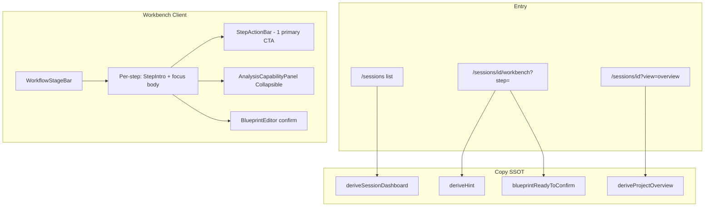

# Phase 4: 核心界面密度重构 — Research

**Researched:** 2026-05-26  
**Domain:** Next.js App Router UI density — workbench flow, sessions list, CTA/token unification  
**Confidence:** HIGH (codebase-verified); MEDIUM for Collapsible refactor patterns (Radix already in repo)

<user_constraints>
## User Constraints (from CONTEXT.md)

### Locked Decisions

#### 工作台三步分段（WB-01）
- **D-01:** 保留 `FlowStep` = `upload` | `analysis` | `compare` | `generate` 与 `WorkflowStageBar`；每步 **首屏仅 1 个主 CTA**（02-UI-SPEC），次要操作 `outline`/`ghost`。
- **D-02:** **分析步**默认视图 = `PipelineBar` + 章节树/批量区 + **单一**底部主操作条；`AnalysisCapabilityPanel` **默认折叠**（Collapsible），展开后 **单列**摘要，禁止 3 列 12px 密集格（backlog #36）。
- **D-03:** **对比步**移除或大幅降低 `min-h-[680px]` 硬编码；蓝图区用 flex + `min-h-0`，章节条可折叠（`CollapsedChaptersBar` 保持）；页脚 panel **合并**为一条 action bar，不与 `BlueprintEditor` 重复说明（backlog #7、#51）。
- **D-04:** **生成步**变体列表 + `GenerateDrawer`；空态对齐 `EmptySlot` 步骤编号模式（backlog #55）；上传步维持现有 health 提示，状态色改用 `--info`/`--warning`/`--destructive` token（backlog #47）。
- **D-05:** `StepIntro` 标题 **动作导向、单行优先**（如「拆解章节」「整理融合蓝图」「生成变体」），禁止两行技术术语标题（backlog #5）。
- **D-06:** 顶栏「项目概览」链（Phase 3）保留；本阶段仅抛光间距与 `type-*` 工具类，不移动 redirect 逻辑。

#### 会话列表与概览（WB-02）
- **D-07:** `/sessions` 首屏 **合并**「主状态」与「快速入口」为 **单一** hero panel 或上下两段 `space-y-10`，删除重复 `surface-panel` 层叠（backlog #6、#51）。
- **D-08:** 指标区（4 MetricCard）**默认折叠**或收成 **一行 3–4 个 caption 统计**，首屏以项目列表为主；图标 **禁止** 装饰性 `text-primary`（backlog #49）。
- **D-09:** `SessionsClient` 双书/单书分区：单书区 **默认折叠**（Collapsible，文案「单书兼容项目」）；双书卡片强化 `deriveSessionDashboard` 的 `nextHref` 与状态徽章（mode、蓝图状态、分析进度）。
- **D-10:** 列表项 **一眼可读**：主标题 + 一行 muted 下一步 + 语义状态色（`flash`/`info`/`locked`）；移除侧栏「本页规则」常驻 panel，改为 **情境 hint**（`HintBanner` 或 caption，仅列表页一次）（backlog #8）。
- **D-11:** 项目概览页（`ProjectOverviewPage`）panel 数 ≤2，主 CTA 与 workbench 动词一致（「进入工作台」「确认蓝图」）。

#### 主 CTA 与反馈统一（WB-03）
- **D-12:** **确认蓝图**：全站唯一文案「确认蓝图」；`variant="default"` 仅当 `blueprintReadyToConfirm`；否则 disabled + caption 说明（workbench + 概览一致）。
- **D-13:** **生成新版本**：主 CTA 文案统一；打开 `GenerateDrawer` 前若蓝图未 confirmed → 阻断 toast + 链至 compare 步（现有逻辑保留，统一 copy）。
- **D-14:** **批量分析**：主按钮在分析步 footer；进行中显示 `BatchTracker` + route-level loading（新增 `workbench/loading.tsx` skeleton）（backlog #53）。
- **D-15:** 装饰性 `text-primary` **清零**于 workbench + sessions 路由；`primary` 仅用于可点击主 Button（02-UI-SPEC § Color）。
- **D-16:** 全 phase 触及的 `(app)/sessions/**` 文件 **禁止新增** `text-[Npx]`；存量迁移到 `type-display`/`type-title`/`type-body`/`type-caption`（backlog #9、#45）。

#### 排版与间距（消费 02-UI-SPEC）
- **D-17:** 步骤间大段分隔 `space-y-10`（40px）；panel 内 `p-5`/`p-6` 对齐 SPEC；同一步内最多 **2** 层 `surface-panel`（含 footer bar）。
- **D-18:** `PipelineBar` 保留三步 glyph；**非当前** 步 label 保持 muted，**禁止** 装饰性 primary 分隔符外溢。

### Claude's Discretion
- `workbench-client.tsx` 是否拆分为 `analysis-step.tsx` / `compare-step.tsx` 等子模块由 planner/executor 决定，以 **行为不变** 为前提。
- `AnalysisCapabilityPanel` 折叠默认态 vs 完全移入 Sheet：优先 Collapsible 默认 closed（与 Phase 3「更多工具」一致）。
- 概览链放置（header vs PipelineBar）在 D-06 范围内微调。

### Deferred Ideas (OUT OF SCOPE)
- **settings 长表单分段**（backlog #14）— Phase 5 或 backlog
- **studio/compare 独立页密度**（backlog #13）— 非 WB 范围，Phase 5 QLT-03 抽查
- **workbench 拆文件 &lt;500 行** — 工程债；若 04-01 自然拆分则接受，不作 phase gate
- **CNV-01 legacy generate API** — v2 可选收敛
</user_constraints>

<phase_requirements>
## Phase Requirements

| ID | Description | Research Support |
|----|-------------|------------------|
| WB-01 | 双书工作台：减少同屏面板数，分析/蓝图/生成阶段视觉分段清晰 | 04-01：Collapsible 能力面板、每步单一 action bar、`space-y-10`、移除 `min-h-[680px]`、StepIntro 改写 |
| WB-02 | 会话列表与项目概览：列表可读、状态一眼可辨，无仪表盘噪声 | 04-02：合并 `page.tsx` hero、折叠指标/单书区、侧栏→HintBanner、`ProjectOverviewPage` panel 收敛 |
| WB-03 | confirm 蓝图、生成、批量分析：一致主按钮层级与反馈 | 04-03：CTA 文案 SSOT、`blueprintReadyToConfirm` 门禁、loading skeleton 增强、装饰性 primary 清零 |
</phase_requirements>

## Summary

Phase 4 is a **layout and visual-hierarchy refactor** on existing components — not new product logic. The highest debt lives in `workbench-client.tsx` (~1368 lines, **10×** `surface-panel`, **41×** arbitrary `text-[Npx]`, analysis step stacking six heavyweight regions). Sessions list adds **two hero panels + four MetricCards** before `SessionsClient`, plus a rules sidebar that competes with the project grid.

Phase 3 already shipped Radix `Collapsible` in `app-nav.tsx` and fixed shell CTAs; Phase 4 applies the same primitive to workbench capability copy and single-book list sections. `deriveHint` and `deriveSessionDashboard` are the correct SSOT for “下一步” copy — UI should **display** them, not duplicate strings in panels.

**Critical correction vs backlog #53:** `src/app/(app)/sessions/[id]/workbench/loading.tsx` **already exists** (generic `PageLoadingShell`). Plan 04-01 should **upgrade** it to a workbench-shaped skeleton (stage bar + dual column placeholders), not create the file from scratch.

**Primary recommendation:** Three plans map cleanly to WB-01/02/03 — workbench step density first (unblocks P0), then sessions/overview whitespace, then cross-route CTA + token sweep with a small shared constants module.

## Architectural Responsibility Map

| Capability | Primary Tier | Secondary Tier | Rationale |
|------------|-------------|----------------|-----------|
| Step layout / panel density | Browser (React client components) | — | Pure presentation in `workbench-client.tsx` |
| Collapsible disclosure (capability guide, metrics, single-book) | Browser | — | Radix Collapsible; default state in component |
| “下一步” / hint text | API-derived state → **lib SSOT** | Browser display | `deriveHint`, `deriveSessionDashboard`, `deriveProjectOverview` |
| Confirm / generate / batch actions | Browser triggers → API routes | — | Existing `BlueprintEditor`, batch hooks unchanged |
| Route loading skeleton | Frontend Server (Next `loading.tsx`) | — | RSC boundary; no business logic |
| Session list hero / metrics | Frontend Server (`page.tsx`) + Client (`SessionsClient`) | — | SSR summary + client grid |

## Standard Stack

### Core

| Library | Version | Purpose | Why Standard |
|---------|---------|---------|--------------|
| Next.js App Router | (repo lockfile) | `loading.tsx`, RSC pages | Already used for sessions/workbench |
| `@radix-ui/react-collapsible` | 1.1.12 [VERIFIED: npm registry] | Default-closed panels | Already in `package.json`; pattern in `app-nav.tsx` |
| shadcn `Button` variants | (repo) | Single primary CTA per viewport | 02-UI-SPEC § Color |
| `type-*` utilities | `globals.css` | Typography migration target | Phase 2 contract |

### Supporting

| Library | Version | Purpose | When to Use |
|---------|---------|---------|-------------|
| `PageLoadingShell` | internal | Route skeleton base | Extend in `workbench/loading.tsx` |
| `HintBanner` | internal | One-line contextual hint | Sessions list + workbench (fix token use) |
| `BatchTracker` | internal | In-flight batch feedback | Analysis step only |
| `sonner` toast | (repo) | Generate blocked / errors | Keep; unify toast copy in 04-03 |

### Alternatives Considered

| Instead of | Could Use | Tradeoff |
|------------|-----------|----------|
| Collapsible (D-02) | Sheet for capability panel | Sheet hides context entirely; CONTEXT locked Collapsible |
| Inline footer `surface-panel` | Sticky `StepActionBar` without panel wrapper | **Preferred** per 02-UI-SPEC § Surfaces (“步骤页脚不另包 surface-panel”) |
| New metrics component | Collapse existing `MetricCard` section | D-08 locked collapse, not delete data |

**Installation:** None — phase is refactor-only.

## Package Legitimacy Audit

> No new external packages. Existing `@radix-ui/react-collapsible@1.1.12` verified on npm registry.

| Package | Registry | slopcheck | Disposition |
|---------|----------|-----------|-------------|
| — | — | — | N/A |

## Architecture Patterns

### System Architecture Diagram



### Recommended Project Structure (optional split per discretion)

```
src/app/(app)/sessions/[id]/workbench/
├── workbench-client.tsx          # orchestration (or thinner)
├── loading.tsx                   # step-aware skeleton
├── analysis-step.tsx             # optional extract
├── compare-step.tsx
├── generate-step.tsx
└── upload-step.tsx

src/lib/workbench/
├── derive-hint.ts                # SSOT — extend tests if copy changes
└── cta-copy.ts                   # NEW — 04-03 shared labels (recommended)

src/components/workbench/
├── step-intro.tsx                # optional — type-* + action titles
└── step-action-bar.tsx           # optional — non-panel footer
```

### Pattern 1: Radix Collapsible (default closed)

**What:** Mirror Phase 3 `AppNav` “更多工具” — `Collapsible` + `CollapsibleTrigger` + `CollapsibleContent`, default `open={false}`.

**When to use:** `AnalysisCapabilityPanel` (hide 3-col grid until expand), sessions metrics block, single-book `SessionSection`.

**Example:**

```tsx
// Pattern source: src/components/app-nav.tsx (Phase 3)
import {
  Collapsible,
  CollapsibleContent,
  CollapsibleTrigger,
} from "@/components/ui/collapsible";

<Collapsible defaultOpen={false}>
  <CollapsibleTrigger className="type-mono-label text-muted-foreground">
    分析能力说明
  </CollapsibleTrigger>
  <CollapsibleContent className="space-y-4 pt-4">
    {/* single-column summary only when open */}
  </CollapsibleContent>
</Collapsible>
```

**Current gap:** `AnalysisCapabilityPanel` uses `expanded` state but **always renders** the `lg:grid-cols-3` block; `expanded` only toggles “推荐人工复核” footer (#36). Refactor must hide dense grid when closed.

### Pattern 2: Single primary CTA per step

**What:** One `Button variant="default"` per active `FlowStep`; merge duplicate footers.

| Step | Primary CTA (locked) | Secondary |
|------|---------------------|-----------|
| upload | 进入分析（`uploadSummary.actionLabel`） | outline 概览链 |
| analysis | 批量分析（per book, in tree) + footer **前往对比** | Collapsible 说明 |
| compare | **确认蓝图** in `BlueprintEditor` + footer **前往生成** | ghost 解锁 |
| generate | **生成新版本** → `GenerateDrawer` | outline 比较 |

**Anti-pattern:** Second `surface-panel` footer repeating `BlueprintEditor` status text — merge into one `StepActionBar` with `deriveHint` caption.

### Pattern 3: Typography migration map

| Current (workbench) | Target utility |
|---------------------|----------------|
| `text-[22px] font-semibold` StepIntro | `type-display` or `type-title` |
| `text-[20px]` / `text-[18px]` headings | `type-title` |
| `text-[13px]` body | `type-body` |
| `text-[12px]` muted | `type-caption` |
| `font-mono text-[10.5px]` labels | `type-mono-label` |

**Arbitrary px counts (grep, 2026-05-26):** workbench-client 41, sessions/page 6, SessionsClient 9, `[id]/page` 5, analysis-accordion-panel 13 (touch only if in phase scope for dual overview).

### Pattern 4: Semantic status colors (upload / health)

Replace `amber-*` / `sky-*` / `text-amber-300` with token classes:

| Tone | Classes |
|------|---------|
| warning | `border-warning/30 bg-warning/5 text-warning` |
| info / fallback | `border-info/30 bg-info/5 text-info` |
| blocked | `border-destructive/35 bg-destructive/8 text-destructive` |
| success | `text-flash` |

Defined in `02-UI-SPEC.md` § Color roles [CITED: `.planning/phases/02-minimal-design-contract/02-UI-SPEC.md`]

### Pattern 5: `deriveHint` + dashboard integration

- **Workbench:** `HintBanner` already consumes `deriveHint` — change banner text from `text-primary/90` to `text-muted-foreground` (D-15).
- **List cards:** `ProjectCard` already shows `nextActionLabel` + `lastActivityLabel` from `deriveSessionDashboard` — tighten to **one** muted line under title; use semantic pill for `stageLabel` (`待确认蓝图` → `text-locked` / `text-info`).
- **Overview:** `overview.nextAction.label` should align with CTA table (“进入工作台确认蓝图” → primary button “确认蓝图” only when on compare-ready state).

### Anti-Patterns to Avoid

- **Decorative `text-primary` on icons/hints:** `HintBanner`, `FolderKanban`, `Clock3`, `StageLine` indices — violates 02-UI-SPEC.
- **`min-h-[680px]` on compare:** Forces viewport scroll; use `flex flex-col min-h-0 flex-1` parent.
- **Three-column capability grid at rest:** Violates D-02 even when “collapsed” today.
- **New `text-[Npx]` in touched files:** Hard gate D-16.

## Don't Hand-Roll

| Problem | Don't Build | Use Instead | Why |
|---------|-------------|-------------|-----|
| Collapse/expand panels | Custom `useState` + CSS height hacks | `@radix-ui/react-collapsible` | Focus, a11y, Phase 3 precedent |
| Step progress | New wizard | `WorkflowStageBar` + `PipelineBar` | Already wired to `FlowStep` |
| Next-step copy | Inline strings per panel | `deriveHint` / `deriveSessionDashboard` | Tests exist; prevents drift |
| Confirm eligibility | Ad-hoc checks | `blueprintReadyToConfirm` | API + `BlueprintEditor` share schema |
| Route loading | Spinner-only div | `PageLoadingShell` + layout-specific blocks | Consistent with `/sessions/loading.tsx` |

## Common Pitfalls

### Pitfall 1: “Collapsed” panel still renders dense grid

**What goes wrong:** Analysis step still shows 6 regions; P0 unfixed.  
**Why:** `analysisGuideExpanded` only gates bottom section, not the 3-column grid.  
**How to avoid:** Wrap **all** detail in `CollapsibleContent`; collapsed state = `type-caption` one-liner from `ANALYSIS_CAPABILITY_GUIDE.shortSummary`.  
**Warning signs:** `lg:grid-cols-3` in DOM when panel closed.

### Pitfall 2: Duplicate confirm / generate copy

**What goes wrong:** User sees「生成新小说」「再生成一版」「生成变体」on one path.  
**Locations:** `workbench-client.tsx:852-853`, `blueprint-editor.tsx:198`, `generate-drawer.tsx:105`, `generate-panel.tsx:168`.  
**How to avoid:** `04-03` introduces `WORKBENCH_CTA` constants; update `derive-hint.test.ts` if hint text changes.

### Pitfall 3: Breaking dual redirect (Phase 3)

**What goes wrong:** Overview becomes default again.  
**How to avoid:** Do not edit `sessions/[id]/page.tsx` redirect guards (`mode === "dual"` → workbench).  
**Warning signs:** Changes to `query.view !== "overview"` branch.

### Pitfall 4: Regressing batch / generate APIs

**What goes wrong:** Tests fail on 409 messages.  
**How to avoid:** UI-only changes; keep API error strings unless QLT explicitly allows.  
**Verification:** `npm test` (188+ tests per REQUIREMENTS QLT-01).

### Pitfall 5: Overview panel count

**What goes wrong:** `ProjectOverviewPage` still has Editorial + KeyResults + 下一步 + ImportHealth + ExtendedAnalysis (>2 panels).  
**How to avoid:** D-11 means **primary narrative panels ≤2** — collapse ExtendedAnalysis behind Collapsible or move below fold with clear hierarchy; planner should count `surface-panel` at first viewport.

## Code Examples

### StepActionBar without `surface-panel` (02-UI-SPEC)

```tsx
// Target pattern for upload/analysis/compare footers
<div className="flex flex-col gap-3 border-t border-border/60 pt-6 sm:flex-row sm:items-center sm:justify-between">
  <p className="type-caption max-w-2xl">{footerCaption}</p>
  <Button disabled={!canProceed}>{primaryLabel}</Button>
</div>
```

### Compare step flex shell (replace min-h-[680px])

```tsx
<section className="flex min-h-0 flex-1 flex-col space-y-6">
  <PipelineBar {...pipelineProps} />
  <CollapsedChaptersBar {...} />
  <div className="min-h-0 flex-1 overflow-hidden">
    <BlueprintEditor {...} />
  </div>
  <StepActionBar caption={hint.text} primaryLabel="前往生成" ... />
</section>
```

### CTA copy SSOT (recommended for 04-03)

```ts
// src/lib/workbench/cta-copy.ts
export const CTA_COPY = {
  confirmBlueprint: "确认蓝图",
  generateVariant: "生成新版本",
  generateVariantAgain: "生成新版本", // same label per D-13
  goToCompare: "前往对比",
  goToGenerate: "前往生成",
} as const;
```

### Workbench loading upgrade

```tsx
// Extend existing loading.tsx — stage-aware, not generic 2-card grid only
export default function WorkbenchLoading() {
  return (
    <div className="app-page space-y-10">
      <PageLoadingShell cards={0} titleWidth="w-64" />
      <div className="grid gap-4 lg:grid-cols-2">
        <SkeletonCard />
        <SkeletonCard />
      </div>
    </div>
  );
}
```

## State of the Art

| Old Approach | Current Approach | When Changed | Impact |
|--------------|------------------|--------------|--------|
| `/create` primary CTA | `/upload?mode=dual` | Phase 3 | sessions page already aligned |
| 4 equal nav items | Collapsible「更多工具」 | Phase 3 | Reuse for Phase 4 panels |
| Generic loading only | Upgrade workbench skeleton | Phase 4 D-14 | File exists; enhance |
| `text-primary` hints | `text-muted-foreground` | Phase 4 D-15 | `HintBanner` first fix |

**Deprecated/outdated:**
- Audit claim “no loading.tsx” — **stale**; file present but too generic for batch UX.

## Assumptions Log

| # | Claim | Section | Risk if Wrong |
|---|-------|---------|---------------|
| A1 | `ProjectOverviewPage` “≤2 panels” allows collapsing ExtendedAnalysis rather than deleting | WB-02 | Scope creep if user expects removal |
| A2 | Single shared `cta-copy.ts` is acceptable minimal abstraction | 04-03 | Could inline if planner prefers fewer files |
| A3 | `analysis-accordion-panel.tsx` out of 04-01 unless dual overview touched | Scope | Leftover arbitrary px on legacy dual analysis UI |

## Open Questions

1. **Metrics collapse UX**
   - What we know: D-08 allows “一行 caption 统计” OR Collapsible.
   - What's unclear: Whether summary numbers stay visible when collapsed.
   - Recommendation: Default collapsed with one-line `type-caption` row (`4 活跃 · 2 待确认蓝图`); expand for full MetricCard grid.

2. **Overview ExtendedAnalysis section**
   - What we know: D-11 panel budget tight with current 5+ sections.
   - Recommendation: Collapsible below fold, not in first two panels.

## Environment Availability

| Dependency | Required By | Available | Version | Fallback |
|------------|------------|-----------|---------|----------|
| Node.js | `npm test` | ✓ | v22.22.0 | — |
| npm | test/lint | ✓ | 11.9.0 | — |
| Next.js dev server | Manual UAT | ✓ (assumed) | repo | — |

**Missing dependencies with no fallback:** None for this UI-only phase.

## Security Domain

Phase 4 is presentation-only; no new auth surface. Preserve existing API gates:

| ASVS Category | Applies | Standard Control |
|---------------|---------|------------------|
| V5 Input Validation | no change | Server routes unchanged |
| V4 Access Control | no change | Session ownership in API |

**Threat patterns:** None introduced; avoid putting sensitive state in client-only hint strings (already derived from server props).

## Plan Split Recommendations

### 04-01 — Workbench layout segmentation (WB-01)

| Task cluster | Files | Acceptance signal |
|--------------|-------|-------------------|
| Refactor `AnalysisCapabilityPanel` to Radix Collapsible; collapsed = single caption | `workbench-client.tsx` | DOM: no 3-col grid when closed |
| `space-y-10` per step; StepIntro titles per D-05 | same | Titles ≤1 line action verbs |
| Remove `min-h-[680px]`; flex compare layout | same | No arbitrary 680px min-height |
| Merge step footers → `StepActionBar` (no extra `surface-panel`) | same | ≤2 `surface-panel` per step |
| Upload health amber/sky → semantic tokens | same | grep no `amber-`/`sky-` in file |
| Upgrade `workbench/loading.tsx` | `loading.tsx` | Skeleton matches 2-col analysis layout |
| Optional file split | `analysis-step.tsx` etc. | Behavior parity; `npm test` green |

**Do not change:** `FlowStep` enum, `navigateToStep`, API fetch handlers, `BlueprintEditor` save/confirm logic.

### 04-02 — Sessions list & overview whitespace (WB-02)

| Task cluster | Files | Acceptance signal |
|--------------|-------|-------------------|
| Merge hero panels or `space-y-10` stack | `sessions/page.tsx` | First screen ≤2 major blocks before list |
| Collapse metrics / caption row | `page.tsx` | List is dominant focus |
| Collapsible single-book section | `SessionsClient.tsx` | Default closed |
| Remove「本页规则」sidebar; add list HintBanner once | `SessionsClient.tsx` | No rules `surface-panel` |
| Overview panel budget | `project-overview-page.tsx`, related | ≤2 primary panels above fold |
| Token pass on list cards | `project-card.tsx`, `page.tsx` | No decorative icon `text-primary` |
| Align overview CTA labels with D-11 | `overview.ts` / header | Verbs match workbench |

### 04-03 — Primary CTA & feedback unification (WB-03)

| Task cluster | Files | Acceptance signal |
|--------------|-------|-------------------|
| Introduce `CTA_COPY` / update all generate labels to「生成新版本」 | workbench, `blueprint-editor`, `generate-drawer`, `generate-panel` | grep unified label |
| Confirm blueprint: disabled + caption when `!blueprintReadyToConfirm` | `blueprint-editor`, overview CTA | Only one default confirm button |
| Generate gate toast + link to compare | existing handler | Copy matches D-13 |
| `HintBanner` + sessions icons: muted not primary | `hint-banner.tsx`, `SessionsClient`, `page.tsx` | `text-primary` only on `<Button variant="default">` |
| Typography sweep D-16 | all `(app)/sessions/**` touched | Zero new `text-[`; reduced count |
| Run `npm test` | — | QLT-01 |

## Sources

### Primary (HIGH confidence)
- `.planning/phases/04-core-interface-density/04-CONTEXT.md` — locked decisions
- `.planning/phases/02-minimal-design-contract/02-UI-SPEC.md` — tokens, CTA, spacing
- `.planning/phases/03-app-shell-navigation-ia/03-UI-SPEC.md` — shell constraints
- `src/app/(app)/sessions/[id]/workbench/workbench-client.tsx` — density inventory
- `src/app/(app)/sessions/page.tsx`, `SessionsClient.tsx` — list density
- `src/lib/workbench/derive-hint.ts`, `src/lib/sessions/dashboard.ts` — SSOT
- `src/components/app-nav.tsx` — Collapsible reference

### Secondary (MEDIUM confidence)
- `.planning/phases/01-ux-audit-matrix/01-AUDIT-BACKLOG.md` — P0/P1 line items
- `@radix-ui/react-collapsible@1.1.12` — npm registry verification

## Metadata

**Confidence breakdown:**
- Standard stack: HIGH — no new deps; patterns in repo
- Architecture: HIGH — file-level audit complete
- Pitfalls: HIGH — grep-verified copy/layout drift

**Research date:** 2026-05-26  
**Valid until:** 2026-06-26 (stable UI contract phase)
