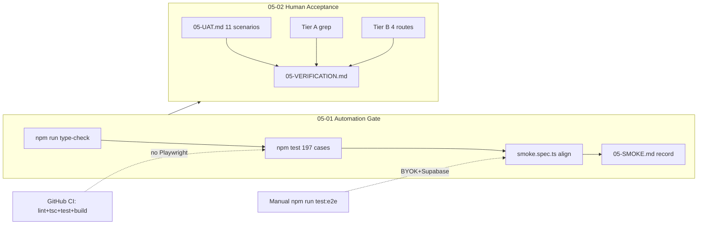

# Phase 5: 验收与 SaaS 级打磨 — Research

**Researched:** 2026-05-26  
**Domain:** QA / acceptance — unit regression, Playwright smoke alignment, owner UAT, Tier A/B visual grep  
**Confidence:** HIGH (test suite + selector drift verified in-repo); MEDIUM (Tier A grep policy on legacy `text-[Npx]` debt)

<user_constraints>
## User Constraints (from CONTEXT.md)

### Locked Decisions

#### 自动化回归深度（QLT-01）
- **D-01:** **硬性门禁** = `npm run type-check` + `npm test`（全量 `src/**/*.test.ts`）；每个 plan task 结束前须复跑。
- **D-02:** **主路径 e2e** 以现有 `tests/e2e/smoke.spec.ts` 为 SSOT：已覆盖 login → dual upload → workbench 分析 → blueprint patch/confirm（API）→ UI「生成新版本」→ 阅读全文；05-01 **不重复造轮**，仅修复因 Phase 4 文案/布局导致的 selector 漂移。
- **D-03:** **CI 策略：** 默认 PR/本地门禁以单元测试为主；Playwright **不**作为无密钥 CI 的 blocking job。在 `05-01` 产出 **`05-SMOKE.md`**（或 PLAN 内等价章节）：列明运行 `npm run test:e2e` 的前置（`.env`、`configureLlm`、超时 15min），供所有者/发布前手动执行；ROADMAP SC#1「手动冒烟通过」= 该脚本最近一次成功 + 日期记录。
- **D-04:** 若 smoke 失败仅因 LLM/网络，区分 **产品回归** vs **环境**；产品问题必须修，环境记录在 VERIFICATION 而不算 phase complete。
- **D-05:** 可选加固：为 `cta-copy`、shell redirect、`deriveSessionDashboard` 等 Phase 4 触点补 **仅当** `npm test` 发现缺口时增加测试——不追求覆盖率数字。

#### 「愿意每天用」UAT（QLT-02）
- **D-06:** UAT 文档 **`05-UAT.md`**，结构对齐 `04-UAT.md`（frontmatter + Tests + Summary）。
- **D-07:** **场景集** = Phase 4 全部 **8** 项 **保留**（回归壳层 + 密度 + CTA）+ Phase 3 `03-HUMAN-UAT.md` **3** 项合并为 **3** 条追加（30 秒懂主路径、导航噪音、移动 Sheet IA）→ 共 **11** 条；与 Phase 4 重复处（如 shell regression）合并为一条，避免重复劳动。
- **D-08:** **通过标准：** 11 条中 **0 blocker**；允许最多 **3** 条标 `known-acceptable`（须链到 backlog ID + 一句理由）。**QLT-02 二元通过** = 所有者在 Summary 签署「愿意每天打开使用」**且** blocker=0。
- **D-09:** 「愿意每天用」**不**要求 studio/compare/settings 达到主路径同等愉悦度；次要模块不满意记入 `known-acceptable` 或 deferred，**不**否决里程碑。
- **D-10:** 验收执行人 = **所有者本人** walkthrough（非仅代理自述）；代理可准备脚本与截图清单，结论须所有者确认。

#### 视觉一致性抽查（QLT-03）
- **D-11:** **Tier A（必过）** 主路径：`/sessions`、`/sessions/[id]/workbench`、`/upload?mode=dual`、dual 默认 redirect 链；标准 = 无第二套「仪表盘堆叠」首屏（≤2 层 `surface-panel` 于首屏焦点区）、无装饰性 `text-primary`、无新增 `text-[Npx]`（grep 门禁可写入 plan）。
- **D-12:** **Tier B（抽查登记）** `/studio`、`/compare`、`/library`、`/settings`：各 **1** 次快速扫视（5 分钟内/路由），记录「符合 SPEC / 遗留密布局 / 可接受债务」；**不**在 Phase 5 做结构性改版。
- **D-13:** 审计 backlog **#13 studio/compare**、**#14 settings** → **接受债务**，写入 `05-VERIFICATION.md` 的 known debt 表 + `REQUIREMENTS` traceability 备注；v2（CNV-*）再处理。
- **D-14:** **不**再跑全量 gsd-ui-auditor（Phase 1 已有基线）；用 **Tier A grep + 所有者 Tier B 笔记** 满足 QLT-03。若 Tier A grep 失败则必须修。
- **D-15:** Phase 4 已 defer 的 settings/studio 密度 **不**拉回 in-scope；仅验证主路径无「一半新一半旧」的**同一 URL** 内混搭。

#### Phase 3 人工 UAT 遗留
- **D-16:** `03-HUMAN-UAT.md` **不**单独补跑第三轮；其 3 项 **并入** `05-UAT.md`（D-07）。
- **D-17:** Phase 5 UAT 全部通过后，由 executor 将 `03-HUMAN-UAT.md` status 更新为 **complete**（回填 result），并 note「covered by 05-UAT §3.x」。
- **D-18:** `03-VERIFICATION.md` 若仍 open：在 05-02 以「Phase 5 回归覆盖 IA SC」一条 cross-reference 关闭或标 superseded。

#### Backlog 收尾 vs 债务
- **D-19:** P0/P1 主路径项（#1–12 中 sessions/workbench 相关）视为 Phase 4 **已处理**；Phase 5 仅 **验证** 不回滚。
- **D-20:** P2 及 Tier B 项 **不**修代码，除非修复成本 &lt;30min 且零行为变更（文案/token 一行级）。
- **D-21:** Top 15 中未关闭项须在 `05-VERIFICATION.md` 有 ** disposition** 列：`fixed-in-p4` | `verified-in-p5` | `deferred-v2`。

#### 计划拆分与门禁（05-01 / 05-02）
- **D-22:** **05-01（先）** 自动化：test 全绿、smoke selector 对齐、`05-SMOKE.md`、可选 grep 脚本（`text-[Npx]` on Tier A routes）、`05-01-SUMMARY` 记录最后 green 的 test 计数。
- **D-23:** **05-02（后，依赖 05-01）** 人工：`05-UAT.md` 执行与签署、`05-VERIFICATION.md`（QLT-01–03 逐条）、Tier B 抽查表、更新 `03-HUMAN-UAT`。
- **D-24:** Phase 5 **complete** 条件 = D-01 绿 + D-03 冒烟记录 + D-08 签署 + D-11 Tier A 通过 + D-21 disposition 表齐全。
- **D-25:** 里程碑完成后 **不**自动勾选 REQUIREMENTS 复选框——由 `/gsd-complete-milestone` 或人工根据 VERIFICATION 统一勾选 QLT-*。

### Claude's Discretion
- smoke 与 UAT 的具体 selector 修补、grep 脚本实现方式由 planner/executor 决定。
- `known-acceptable` 的 3 条上限可由所有者在 UAT 时缩减为 0–3。
- 是否在 05-01 增加 `upload-branches.spec.ts` 回归由 executor 视时间决定（非硬性）。

### Deferred Ideas (OUT OF SCOPE)
- **CNV-01–03**（legacy API、维度统一、大组件拆分）— v2，本 phase 仅文档引用
- **studio/compare/settings 密度大修**（backlog #13、#14）— v2；Tier B 只登记
- **全站 gsd-ui-auditor 复跑** — 非本 phase；用 Tier A/B 抽查替代
- **`/design-system` 生产 guard**（P3）— 仍不在本里程碑
</user_constraints>

<phase_requirements>
## Phase Requirements

| ID | Description | Research Support |
|----|-------------|------------------|
| QLT-01 | 现有 188+ 单元测试保持通过；变更不破坏 generate-v2 / blueprint confirm 闭环 | **197/197 pass** on 2026-05-26 [VERIFIED: codebase run]; `blueprintReadyToConfirm` + `cta-copy` + `derive-hint` unit coverage; **smoke.spec.ts selector drift** must be fixed in 05-01; manual `05-SMOKE.md` for full e2e |
| QLT-02 | 所有者主观验收：愿意每天打开使用 | `05-UAT.md` 11 scenarios (04×8 + 03×3, merge shell overlap); owner-signed Summary; `03-HUMAN-UAT` backfill |
| QLT-03 | 外观达到成熟 SaaS 水准（克制、留白、一致） | Tier A grep on sessions/upload/workbench; Tier B 4-route notes; backlog #13/#14 `deferred-v2`; no new `text-[Npx]` on Tier A edits |
</phase_requirements>

## Summary

Phase 5 is a **verification and acceptance** phase, not a feature phase. The engineering baseline is already green: `npm run type-check` and **197** unit tests pass with zero failures [VERIFIED: codebase run]. The highest-risk automation gap is **`tests/e2e/smoke.spec.ts`**, which still targets Phase 3-era step headings and CTA strings removed in Phase 4 (`拆解章节`, `整理融合蓝图`, `生成变体`, `CTA_COPY.generateNewVersion`) [VERIFIED: codebase grep]. CI correctly runs only lint, type-check, unit tests, and build — Playwright stays manual per D-03 [VERIFIED: `.github/workflows/ci.yml`].

**Primary recommendation:** Execute **05-01** as (1) keep unit gate green, (2) patch smoke selectors to match `workbench-client.tsx` + `cta-copy.ts`, (3) document manual e2e in `05-SMOKE.md` with environment/LLM failure taxonomy; then **05-02** as owner walkthrough on `05-UAT.md` plus Tier A grep script and Tier B debt table in `05-VERIFICATION.md`.

## Architectural Responsibility Map

| Capability | Primary Tier | Secondary Tier | Rationale |
|------------|-------------|----------------|-----------|
| Unit regression gate (QLT-01) | Local dev / CI job | — | Pure `src/**/*.test.ts`; no browser |
| E2E smoke (confirm → generate-v2) | Playwright (local/pre-release) | API seeding via `page.request` | Exercises full stack + BYOK LLM; not CI-blocking |
| Owner UAT (QLT-02) | Human walkthrough | Agent-prepared checklist | Subjective「愿意每天用」cannot be automated |
| Tier A visual grep (QLT-03) | Static analysis (grep) on route files | Owner spot-check | Enforces SPEC tokens on main-path source |
| Tier B debt registration | Documentation (`05-VERIFICATION.md`) | — | No code changes for #13/#14 per D-13 |
| Backlog disposition | Planning artifacts | — | Traceability only |

## Standard Stack

### Core

| Library | Version | Purpose | Why Standard |
|---------|---------|---------|--------------|
| Node.js test runner | built-in (via `tsx`) | Unit tests | Project SSOT [VERIFIED: `package.json`, `TESTING.md`] |
| `tsx` | ^4.22.2 | TS test import | Co-located `*.test.ts` pattern |
| `@playwright/test` | ^1.60.0 | E2E smoke | Existing `smoke.spec.ts` SSOT [VERIFIED: `package.json`] |
| TypeScript `tsc` | ^5.7.2 | `npm run type-check` | Hard gate D-01 |

### Supporting

| Library | When to Use |
|---------|-------------|
| `node:assert/strict` | All unit assertions |
| Supabase admin client in e2e | Blueprint seed + chapter analyze API posts |
| `tests/e2e/helpers/auth.ts` | `login`, `configureLlm` |

### Alternatives Considered

| Instead of | Could Use | Tradeoff |
|------------|-----------|----------|
| Patch `smoke.spec.ts` | New parallel e2e spec | Rejected by D-02 — duplicates ROADMAP closure |
| CI Playwright | Manual `05-SMOKE.md` | No secrets in GitHub Actions; D-03 locked |

**Installation:** None — Phase 5 adds no dependencies.

## Package Legitimacy Audit

> Phase 5 does not install external packages. No slopcheck run required.

**Packages removed due to slopcheck [SLOP] verdict:** none  
**Packages flagged as suspicious [SUS]:** none

## Architecture Patterns

### System Architecture Diagram



### Recommended Verification Artifacts

```
.planning/phases/05-saas/
├── 05-RESEARCH.md          (this file)
├── 05-01-PLAN.md           (automation)
├── 05-02-PLAN.md           (UAT + visual)
├── 05-SMOKE.md             (e2e prereqs + last run date)
├── 05-UAT.md               (11 scenarios + owner sign-off)
└── 05-VERIFICATION.md      (QLT-01–03 + backlog disposition + Tier B)
```

### Pattern 1: Hard gate per task (D-01)

**What:** Every 05-01 task ends with `npm run type-check && npm test`.  
**When:** Before commit and before handing off to 05-02.

```bash
npm run type-check && npm test
```

[VERIFIED: codebase run — 197 pass, 2026-05-26]

### Pattern 2: Smoke selector alignment (D-02)

**What:** Update Playwright `getByRole` strings to match `StepIntro` titles and `CTA_COPY` — do not rewrite flow structure.

| smoke.spec.ts (stale) | Current UI [VERIFIED: codebase grep] | Action |
|----------------------|-------------------------------------|--------|
| heading `第 2 步 · 分析两本参考小说` | `拆解章节` (`workbench-client.tsx` L741) | Replace |
| heading `第 3 步 · 对比并整理骨架` | `整理融合蓝图` (L793) | Replace |
| heading `第 4 步 · 生成新小说` | `生成变体` (L860) | Replace |
| button `生成新小说` | Removed (04-03); use `前往生成` then `生成新版本` | Replace flow |
| button `再生成一版` | Removed; post-gen CTA is `生成新版本` / variant UI | Remove or assert `生成新版本` only |
| button `生成新版本` | `CTA_COPY.generateNewVersion` (L889, drawer L106) | Keep — click opens drawer, submit again in sheet |

**Generate step flow after blueprint confirm:**

1. `page.reload()` (existing)
2. If needed: `getByRole("button", { name: "前往生成", exact: true })`
3. `getByRole("heading", { name: "生成变体", exact: true })`
4. `getByRole("button", { name: "生成新版本", exact: true }).click()` — opens `GenerateDrawer`
5. `getByRole("button", { name: "生成新版本", exact: true }).click()` — submit inside sheet (two visible buttons possible; use `.last()` or scope to dialog if flaky)
6. `getByRole("heading", { name: "生成结果", exact: true })` — unchanged [VERIFIED: L877]
7. `阅读全文 →` — unchanged [VERIFIED: `variant-card.tsx` L109]

**Still valid selectors [VERIFIED: grep]:** `创建并进入工作台`, `前往对比`, `登录`, `第 1 步 · 导入两本参考小说` (upload step only).

### Pattern 3: E2E failure taxonomy (D-04)

| Symptom | Class | Phase 5 action |
|---------|-------|----------------|
| Selector / timeout on known UI string | **Product regression** | Fix selector or UI regression in 05-01 |
| `chapter analysis failed` / LLM 401 / rate limit | **Environment** | Log in `05-VERIFICATION.md`; do not block on single flaky run if product grep green |
| Missing `.env` / `SUPABASE_SERVICE_ROLE_KEY` | **Environment** | Document in `05-SMOKE.md`; block until configured |
| `npm test` failure | **Product regression** | Must fix before phase complete |

### Pattern 4: Tier A grep gate (D-11, D-14)

**Recommended script (planner discretion):**

```powershell
# Tier A paths — fail on NEW violations; report legacy debt explicitly
rg "text-\[[0-9]+px\]" "src/app/(app)/sessions/page.tsx" "src/app/(app)/sessions/SessionsClient.tsx" "src/app/(app)/sessions/[id]/workbench/workbench-client.tsx" "src/app/(app)/upload" "src/app/(app)/sessions/[id]/page.tsx"
rg "text-primary" "src/app/(app)/sessions/[id]/workbench/workbench-client.tsx" "src/app/(app)/upload"
```

**Current state [VERIFIED: codebase grep]:**

| Check | `workbench-client.tsx` | `sessions/page.tsx` + `SessionsClient` | `upload/` | `sessions/[id]/page.tsx` |
|-------|------------------------|----------------------------------------|-----------|---------------------------|
| `text-[Npx]` | **0** | **0** | **0** | **6** (display sizes on overview hero) |
| decorative `text-primary` | **0** | N/A | **0** | muted only on overview |
| `surface-panel` | Multiple in compare/generate (not first-screen upload/analysis) | 1 hero panel | — | 1 overview panel |

**Legacy debt outside Tier A focus:** `analysis-accordion-panel.tsx` still has `text-[Npx]` + decorative `text-primary` but is **not** mounted in current workbench `analysisGrid` (uses `ChapterTree` only) [VERIFIED: codebase grep]. Tier A fail policy should target **files on dual main path**, not orphan legacy panels.

### Pattern 5: `05-UAT.md` eleven scenarios (D-06–D-07)

| # | Source | Title | Notes |
|---|--------|-------|-------|
| 1–7 | `04-UAT.md` | Sessions density, cards, overview, workbench steps, confirm gate, generate block, CTA copy | Copy expected/result template verbatim |
| 8 | `04-UAT.md` #8 + `03-HUMAN-UAT` #2 | Shell regression + nav noise | Merge duplicate walkthrough: primary「项目」, 新建→dual upload, workbench redirect, 更多工具 collapsed |
| 9 | `03-HUMAN-UAT` #1 | 30 秒懂双书主路径 | Cognitive — owner times self from `/sessions`; enrich expected with header hint + list CTA |
| 10 | `03-HUMAN-UAT` #3 | Mobile Sheet IA | Real device or narrow viewport; AppNav single source |
| 11 | New (QLT-03) | Tier A visual + Tier B spot-check | Owner confirms grep green + 4-route debt notes; can mark studio/settings `known-acceptable` (#13, #14) |

Tests 8–9 overlap by design: execute **once** with combined expected bullets (D-07「避免重复劳动」).

### Anti-Patterns to Avoid

- **Rewriting smoke from scratch:** Violates D-02; patch selectors only.
- **Blocking CI on Playwright:** No `E2E_*` secrets in `.github/workflows/ci.yml` [VERIFIED].
- **Fixing studio/settings density in Phase 5:** Violates D-13, D-15.
- **Treating LLM timeout as product failure:** Violates D-04.

## Don't Hand-Roll

| Problem | Don't Build | Use Instead | Why |
|---------|-------------|-------------|-----|
| New e2e framework | Custom runner | Existing Playwright + helpers | D-02 SSOT |
| Full UI auditor rerun | gsd-ui-auditor | Tier A grep + Tier B notes | D-14 |
| CTA string duplication in tests | Inline Chinese in spec | Import or mirror `CTA_COPY` literals in assertions | WB-03 SSOT; drift caused current smoke breakage |
| Requirement checkbox automation | Script toggling REQUIREMENTS | `/gsd-complete-milestone` per D-25 | Explicit user/milestone control |

## Common Pitfalls

### Pitfall 1: Smoke passes locally but uses obsolete headings

**What goes wrong:** E2E never run after Phase 4 StepIntro rename; false confidence.  
**Why:** `04-03` removed「第 N 步 · …」pattern from analysis/compare/generate steps [VERIFIED: `04-03-PLAN.md`, `workbench-client.tsx`].  
**How to avoid:** Run `npm run test:e2e` once after selector patch; record date in `05-SMOKE.md`.  
**Warning signs:** Grep `smoke.spec.ts` for `第 2 步` / `生成新小说` / `再生成一版`.

### Pitfall 2: Tier A grep fails on overview `text-[24px]`

**What goes wrong:** Strict「零 text-[Npx]」fails `sessions/[id]/page.tsx` overview hero.  
**Why:** Phase 4 focused workbench/sessions list; overview still uses arbitrary display sizes [VERIFIED: grep].  
**How to avoid:** Gate on **no new matches** vs baseline file list, or allowlist overview typography in plan with owner sign-off (D-11「无新增」).

### Pitfall 3: Conflating 197 tests with ROADMAP「188+」

**What goes wrong:** Requirement text stale; unnecessary test deletion fear.  
**Why:** Phase 4 added `cta-copy.test.ts`, dashboard tests, etc.  
**How to avoid:** Record **197** in `05-01-SUMMARY`; update traceability note only.

### Pitfall 4: Agent-only UAT sign-off

**What goes wrong:** QLT-02 marked pass without owner.  
**Why:** D-10 requires owner walkthrough.  
**How to avoid:** Summary field「愿意每天打开使用」signed by owner; agent supplies evidence links only.

### Pitfall 5: Phase 3 verification left `human_needed`

**What goes wrong:** IA phase appears incomplete in planning tree.  
**Why:** `03-VERIFICATION.md` status `human_needed` [VERIFIED: read].  
**How to avoid:** 05-02 adds supersede/cross-ref row per D-18 when 05-UAT #8–10 pass.

## Code Examples

### Tier A grep (PowerShell / ripgrep)

```bash
rg "text-\[[0-9]+px\]" src/app/(app)/sessions/page.tsx src/app/(app)/sessions/SessionsClient.tsx "src/app/(app)/sessions/[id]/workbench/workbench-client.tsx" src/app/(app)/upload "src/app/(app)/sessions/[id]/page.tsx"
```

### Smoke heading fix (illustrative)

```typescript
// Source: workbench-client.tsx StepIntro titles [VERIFIED: codebase]
await expect(
  page.getByRole("heading", { name: "拆解章节", exact: true }),
).toBeVisible();
```

### Hard gate

```bash
npm run type-check && npm test
```

### CTA SSOT contract (already tested)

```typescript
// src/lib/ui/cta-copy.test.ts [VERIFIED]
assert.equal(CTA_COPY.generateNewVersion, "生成新版本");
```

## State of the Art

| Old Approach | Current Approach | When Changed | Impact |
|--------------|------------------|--------------|--------|
| E2E step titles「第 N 步 · …」 | Action titles「拆解章节」等 | Phase 4 04-01/04-03 | **smoke.spec.ts must update** |
|「生成新小说」「再生成一版」 | `CTA_COPY.generateNewVersion` | Phase 4 04-03 | Smoke generate flow is 2-step drawer |
| REQUIREMENTS「188+ tests」 | 197 tests | Phase 4 | QLT-01 wording is floor, not exact count |
| Playwright in CI | Unit-only CI | Pre-Phase 5 | D-03 manual smoke doc |

## Backlog Top 15 — Disposition for `05-VERIFICATION.md` (D-21)

| # | Item (summary) | Disposition | Evidence |
|---|----------------|-------------|----------|
| 1 | Workbench analysis density / CTA buried | `fixed-in-p4` | 04-01 collapsible panel, step segmentation |
| 2 | 1361 lines / 10× surface-panel | `verified-in-p5` | Reduced panels; file still large — CNV-03 v2 |
| 3 | Sessions header → `/create` | `fixed-in-p4` | dual upload CTA [03/04] |
| 4 | dual default not workbench | `fixed-in-p4` | `page.tsx` redirect L65-66 [VERIFIED] |
| 5 | Analysis StepIntro too long | `fixed-in-p4` |「拆解章节」short title |
| 6 | Sessions list首屏密度 | `fixed-in-p4` | 04-02 hero + collapsible metrics |
| 7 | compare min-h 680px | `fixed-in-p4` | removed from workbench grep |
| 8 | SessionsClient三栏 | `fixed-in-p4` | sidebar rules removed 04-02 |
| 9 | workbench arbitrary px | `verified-in-p5` | 0 in `workbench-client.tsx`; accordion legacy elsewhere |
| 10 | amber/sky status bar | `verified-in-p5` | grep workbench for hardcoded colors in 05-01 |
| 11 | decorative text-primary on workbench | `fixed-in-p4` | 0 matches workbench-client |
| 12 | route loading skeleton | `verified-in-p5` | `workbench/loading.tsx` exists — spot-check in UAT #4 |
| 13 | studio/compare density | `deferred-v2` | D-13 Tier B only |
| 14 | settings long form | `deferred-v2` | D-13 Tier B only |
| 15 | upload vs sessions CTA copy | `verified-in-p5` |「创建并进入工作台」+ shell alignment UAT #8 |

## Test Suite State (QLT-01)

| Metric | Value | Source |
|--------|-------|--------|
| Unit test files | 39 `src/**/*.test.ts` | [VERIFIED: glob] |
| Unit test cases | **197** pass / 0 fail | [VERIFIED: `npm test` 2026-05-26] |
| Type-check | Pass | [VERIFIED: same run] |
| CI jobs | lint, type-check, test, build — **no e2e** | [VERIFIED: `ci.yml`] |
| E2E specs | `smoke.spec.ts` (1 flow), `upload-branches.spec.ts` (3 tests, optional) | [VERIFIED: read] |

### Phase 4 touchpoints — unit coverage map

| Touchpoint | Test file | Gap? |
|------------|-----------|------|
| `CTA_COPY` | `cta-copy.test.ts` | Covered |
| `deriveSessionDashboard` | `dashboard.test.ts` | Covered |
| Shell title / sessions hint | `shell-title.test.ts` | Covered |
| `derive-hint` generate copy | `derive-hint.test.ts` | Covered |
| Dual redirect `page.tsx` | No dedicated route test | **Low** — optional per D-05 if planner wants; e2e/UAT cover |
| `blueprintReadyToConfirm` | `schema.test.ts` | Covered |
| Workbench batch | `chapter-batch.test.ts` | Covered |

**Known failures:** None in unit suite at research time.

**Gaps vs Phase 4:** E2E selectors only (critical); optional `upload-branches.spec.ts` re-run (D-25 discretion).

## Environment Availability

| Dependency | Required By | Available | Version | Fallback |
|------------|------------|-----------|---------|----------|
| Node.js | test, build | ✓ | v22.22.0 | — |
| npm | scripts | ✓ | 11.9.0 | — |
| Playwright CLI | test:e2e | ✓ | 1.60.0 | — |
| `.env` (Supabase + keys) | smoke.spec reads `.env` | ✓ (present) | — | Block e2e without |
| BYOK `E2E_LLM_*` | analyze + generate in smoke | Unknown | — | Document in 05-SMOKE; classify failures per D-04 |
| Chromium browser | Playwright | Not probed | — | `npx playwright install chromium` |

**Missing dependencies with no fallback:** Valid Supabase test user + LLM credentials for full smoke (manual only).

## Security Domain

Phase 5 is QA-only; no new auth surface. Existing controls remain:

| ASVS Category | Applies | Standard Control |
|---------------|---------|------------------|
| V2 Authentication | No change | Supabase auth (existing) |
| V5 Input Validation | No change | Zod on API routes |
| V6 Cryptography | No change | `ENCRYPTION_KEY` for BYOK storage |

| Pattern | STRIDE | Mitigation |
|---------|--------|------------|
| E2E service role in local `.env` | Elevation | Never commit `.env`; smoke reads local only [VERIFIED: smoke.spec.ts] |
| Manual smoke on production URL | Info disclosure | Default `E2E_BASE_URL` = localhost [VERIFIED: `playwright.config.ts`] |

## Assumptions Log

| # | Claim | Section | Risk if Wrong |
|---|-------|---------|---------------|
| A1 | Tier A grep should allowlist pre-existing `page.tsx` overview `text-[Npx]` | Pitfall 2 | False failures block phase |
| A2 | `再生成一版` has no remaining UI button after 04-03 | Smoke alignment | Smoke assertion needs removal not rename |
| A3 | Two-click「生成新版本」(page + drawer) is stable in Playwright | Smoke alignment | May need dialog-scoped locator |

## Open Questions

1. **Tier A `text-[Npx]` on overview — fail or allowlist?**
   - What we know: 6 matches on `sessions/[id]/page.tsx` [VERIFIED: grep].
   - Recommendation: Plan task =「no new px on Tier A files」with baseline snapshot, not zero legacy on overview unless owner wants drive-by fix (&lt;30min per D-20).

2. **Optional `upload-branches.spec.ts` in 05-01?**
   - What we know: 3 tests, no LLM, only login + upload UI [VERIFIED: read].
   - Recommendation: Quick win if time; not required for QLT-01 closure.

## Project Constraints (from .cursor/rules/)

No `.cursor/rules/` directory found in workspace [VERIFIED: glob]. No additional rule constraints beyond CONTEXT and UI-SPECs.

## Sources

### Primary (HIGH confidence)
- `tests/e2e/smoke.spec.ts`, `workbench-client.tsx`, `cta-copy.ts` — selector drift [VERIFIED: codebase grep]
- `npm test` / `npm run type-check` — 197 pass [VERIFIED: codebase run]
- `.github/workflows/ci.yml` — CI scope [VERIFIED: codebase]
- `.planning/phases/05-saas/05-CONTEXT.md` — locked decisions
- `.planning/codebase/TESTING.md` — test conventions

### Secondary (MEDIUM confidence)
- `04-UAT.md`, `03-HUMAN-UAT.md`, `01-AUDIT-BACKLOG.md` — scenario and disposition templates

## Metadata

**Confidence breakdown:**
- Standard stack: HIGH — no new packages; verified scripts
- Architecture: HIGH — acceptance flow fully specified in CONTEXT
- Pitfalls (smoke drift): HIGH — reproduced by grep diff spec vs UI

**Research date:** 2026-05-26  
**Valid until:** 2026-06-26 (stable QA patterns)
