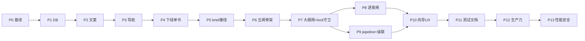
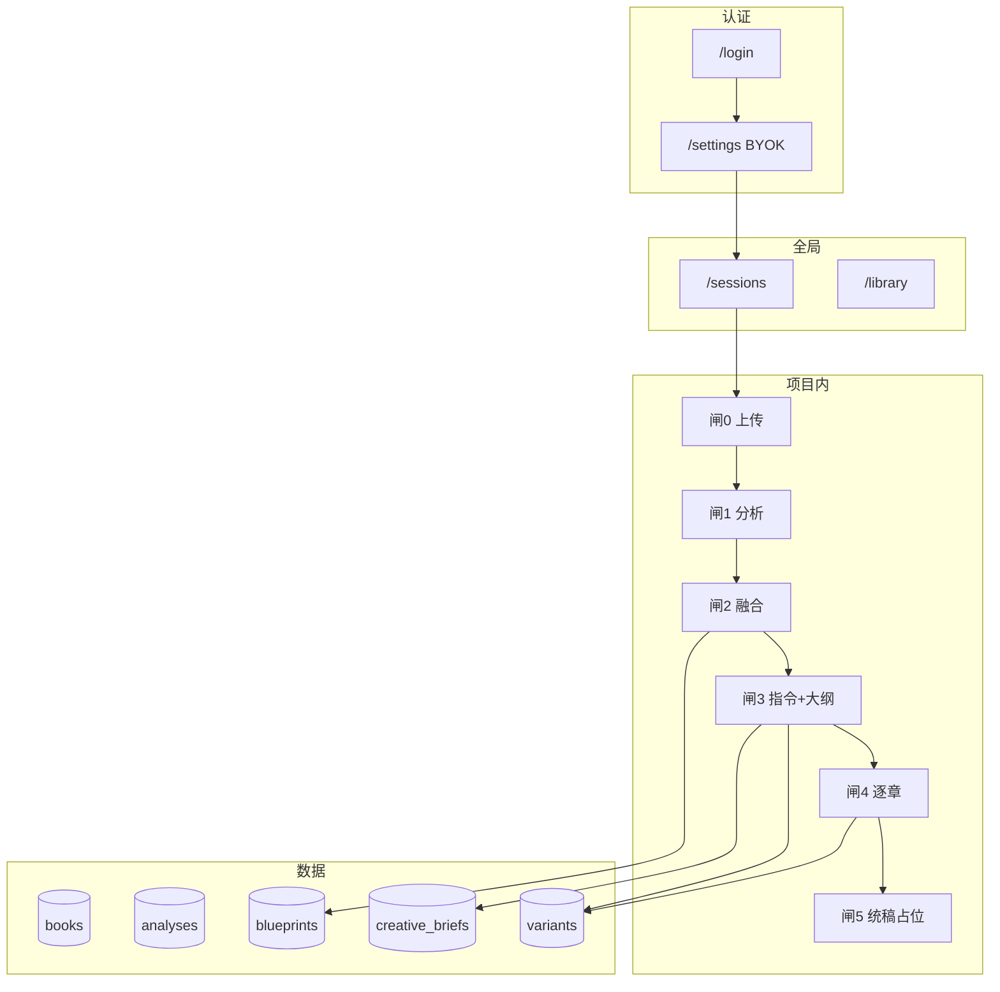

# NovelFusion v0.4 开发计划 — 五道闸主线（Dragon Workflow）

> **文档用途**：团队开发**唯一执行依据**（非演示清单）。合并「巨龙主计划」+ 两轮生产审查补遗。  
> **产品定位**：面向长篇创作者的生产力工具 —— 可恢复、可导出、可计费透明、可长期维护；**不是**功能堆叠 Demo。  
> **产品一句話**：两本书 → 分析 → 融合方案 → 创作指令 → 锁定大纲 → 逐章扩写 → 导出定稿。  
> **已确认**：不要单书老流程；要可控、可预览、可锁定、可回滚、**能交付可用书稿**。  
> **版本**：v0.4（破坏性变更见 [十四、发布](#十四发布与版本)）

---

## 〇、生产力原则（必读）

开发任何功能前用以下标准自检；不满足则视为**未完成**：

| 原则 | 含义 | v0.4 最低要求 |
|------|------|----------------|
| **可完成** | 用户不经隐藏路由能走通主链 | 侧栏 3 项内完成闸1–4 + 导出 |
| **可恢复** | 刷新/断线/失败后能接着干 | 批量分析可重试失败章；蓝图有保存态提示 |
| **可交付** | 产出能离开系统使用 | 闸5 导出合并 `.md`/`.txt`（非仅占位） |
| **可预期** | 费用与耗时透明 | 预览/逐章/全文生成前有费用估算；设置页有本项目用量 |
| **可信赖** | 数据不丢、不乱 | 硬删顺序正确；锁定/归档 API 一致；迁移可回滚 |
| **可维护** | 线上可观测 | `/api/health`、结构化错误、发布检查表 |

**与 Demo 的切割**：隐藏 `/compare`、下线 Studio 独立入口、禁止无 brief 全文生成、禁止未锁大纲 iterate —— 均为**生产力**约束，不是阉割功能。

---

## 目录

0. [生产力原则](#〇生产力原则必读)
1. [执行摘要](#一执行摘要)
2. [产品决策（已锁定）](#二产品决策已锁定)
3. [架构总览](#三架构总览)
4. [数据库迁移 0008](#四数据库迁移-0008)
5. [后端 API](#五后端-api)
6. [前端改造清单](#六前端改造清单)
7. [五道闸交互细则](#七五道闸交互细则)
8. [状态机](#八状态机)
9. [实施阶段 P0–P14](#九实施阶段-p0p14)
10. [测试矩阵](#十测试矩阵)
11. [边界与风险](#十一边界与风险)
12. [验收标准](#十二验收标准)
13. [部署与运维](#十三部署与运维)
14. [发布与版本](#十四发布与版本)
15. [范围外](#十五范围外v04-刻意不做)
16. [开发速查索引](#十六开发速查索引)
17. [生产就绪补遗](#十七生产就绪补遗)
18. [推荐实施顺序](#十九推荐实施顺序给-tech-lead)

---

## 一、执行摘要

### 1.1 现状（对照仓库，2026-05）

| 项 | 现状 |
|----|------|
| 工作台步骤 | 四步：`upload \| analysis \| compare \| generate` |
| `pipeline_stage` | **不存在** |
| `GenerateDrawer` | **未**传 `briefId`；双挂载于 `workbench-client` + `blueprint-editor` |
| `preview` insert | **未**写 `blueprint_id` |
| `iterate` | 不校验大纲已锁定 |
| `variants` DELETE | **无**归档守卫 |
| `unconfirm` | 仅改 blueprint status，无级联 |
| CI | lint + tsc + unit + build；**不跑 E2E** |
| LLM 超时 | `runtime.ts` 默认 **60s**，SSE 路由 `maxDuration=300` — **不匹配** |
| 蓝图保存 | `blueprint-editor` 变更即 PATCH，**无防抖** |
| 硬删会话 | **先删 Storage 再删 DB**（失败则孤儿/不一致） |
| 导出 | 仅 Compare 有导出；工作台**无**书稿导出 |
| `page-data` | 一次加载全部 `variants.content` — 大项目易卡顿 |

### 1.2 交付物

**产品（五道闸）**

- 双书 **五道闸** 工作台主线（闸0 准备 + 闸1–5）
- 下线单书 **UI/API**；历史单书 **只读页**
- `creative_brief` 接入 `generate-v2` / 工作台闸3–4
- 大纲 **锁定** 后方可逐章（v0.4 **不**提供「跳过锁定」）
- 迁移 `0008_dragon_pipeline.sql` + backfill + 类型更新

**生产力（v0.4 必做，见 [十七](#十七生产就绪补遗)）**

- 闸5：**合并章节稿导出** `.md`/`.txt` + 单章复制
- 预览 / 逐章 / 全文生成前 **费用估算**（复用 `cost-estimate` 逻辑）
- 项目卡片展示 **本会话 7 日 LLM 用量**（`llm_usage_events` 按 `session_id`）
- 蓝图 **防抖自动保存** +「已保存 / 保存中 / 失败」状态
- 批量分析 **刷新后可恢复**失败章节列表（`localStorage` 或 `session_jobs` 表二选一，见 17.4）
- `page-data` **不加载**全文 `variants.content`（列表懒加载）
- `GET /api/health` + 生产发布检查表
- LLM 路由超时与 `maxDuration` **对齐**（preview/iterate/book ≥ 240s）

### 1.3 阶段依赖（修正后）



**硬性顺序**：

- 切忌 **跳过 P5** 直接做五闸 UI（闸3/4 会空转）。
- **iterate 锁定校验** 与 lock API 同在 **P7**，不得拖到 P9。
- **先 SQL 0008，再部署能读 `pipeline_stage` 的后端，最后部署五闸前端**。

### 1.4 任务看板（勾选跟踪）

| ID | 阶段 | 任务 | 状态 |
|----|------|------|------|
| p0 | P0 | 基线：unit 绿、E2E smoke 绿、截图 | ☐ |
| p1 | P1 | 0008 + backfill + session-pipeline + workflow API + types | ☐ |
| p2 | P2 | 文案 + smoke/redirect step 同步 | ☐ |
| p3 | P3 | 侧栏 3 项 + studio 重定向 + 死链 | ☐ |
| p4 | P4 | 下线单书 UI/API + 只读旧版页 + upload 默认 dual | ☐ |
| p5 | P5 | CreativeDirectivePanel + briefId + 合同卡 + active 约束 | ☐ |
| p6 | P6 | FlowStep 五闸 + page-data + DragonBar + overview/dashboard | ☐ |
| p7 | P7 | OutlineGate + lock/unlock + preview/iterate 守卫 | ☐ |
| p8 | P8 | ChapterGate + version tree + generate-v2 高级 | ☐ |
| p9 | P9 | advancePipeline + unconfirm 级联 + API 审计 + variants DELETE | ☐ |
| p10 | P10 | 每闸单按钮 + disabledReason | ☐ |
| p11 | P11 | E2E dragon-gates + CHANGELOG + README + .env.example + CI 门禁 | ☐ |
| p12 | P12 | 导出/复制/费用估算/项目用量/蓝图防抖 | ☐ |
| p13 | P13 | page-data 瘦身、超时对齐、health、安全加固 | ☐ |
| p14 | P14 | 批量任务持久化、硬删顺序、发布检查表 | ☐ |

---

## 1.5 代码库已验证风险（实施前知晓）

| 风险 | 位置 | v0.4 处理 |
|------|------|-----------|
| Auth 中间件 fail-open | `src/lib/supabase/middleware.ts` L49：`authError` 时 `return next()` | P13：`(app)` 路由 auth 失败 → 重定向登录或 503 |
| 硬删先 Storage | `src/app/api/sessions/[id]/route.ts` L27–32 | P14：先 DB 软标记/事务删行，再异步清 Storage；失败可重试 |
| `cache_key` 只写不读 | `runtime.ts` + analyses/variants 列 | P13：文档声明「不 dedup」或实现 lookup（二选一） |
| Rate limit 计失败调用 | `rate-limit.ts` 计 `llm_usage_events` 全量 | P13：仅计 `success=true` 或按 operation 加权 |
| 无 operation 级费用上限 | 仅 30 次/分钟 | P12：可选每日 `estimated_cost_cny` 上限（设置页可关） |

---

## 二、产品决策（已锁定）

| 决策 | 选择 |
|------|------|
| 单书主流程 | **下线**（新会话固定 `mode=dual`） |
| 历史 `mode=single` 会话 | **A：只读「旧版项目」页**（展示 analyses/variants，禁止 mutate；无工作台） |
| 全文生成无 brief | **409**，必须带 `active` brief 的 `briefId` |
| 大纲锁定跳过 | **v0.4 不做**（删除原验收「高级跳过」） |
| `generate-v2` 入口 | 仅闸4「高级：全文生成」，强确认 + 偏离大纲警告 |
| 侧栏全局导航 | **项目 / 资料库 / 设置**（去掉创作台、对比） |
| `/compare` | `NEXT_PUBLIC_ENABLE_COMPARE=false` 默认隐藏（路由可保留） |
| `/design-system` | 仅 `NODE_ENV=development` 或 layout 守卫 |
| unconfirm 后 variants | `config.stale = true`（不删行）；UI 过滤 stale |
| 闸5 统稿与交付 | **必做**：按锁定大纲顺序合并 `scope=chapter` 正文导出 `.md`/`.txt`；单章一键复制；无 polish API |
| 费用透明 | 闸1 批量、闸3 preview、闸4 iterate/全文 **弹窗估算**；项目列表显示本会话近 7 日用量 |
| 重新切章 `/api/chapters/parse` | v0.4 **不暴露 UI**；README 标注高级未开放 |
| BYOK 计费 | 用户付给模型商；应用侧防滥用：**频率限制** + 可选**日费用上限**（非 Stripe） |
| Auth 生产 | Supabase **关闭** Confirm email（与 README 一致）或实现验证页 — 部署检查表二选一勾选 |

---

## 三、架构总览

### 3.1 全链路



### 3.2 五道闸映射

| 闸 | 用户展示 | `step` query | 完成条件 | 主要 API |
|----|----------|--------------|----------|----------|
| 0 准备 | 准备 | `upload` | 2 书 ingest 就绪 | upload actions |
| 1 | 第 1/5 闸 分析 | `analysis` | 2 书 chapter brief + book_synthesis | analyze/chapter, analyze/book |
| 2 | 第 2/5 闸 融合 | `fuse` | blueprint `confirmed` | blueprint, confirm |
| 3 | 第 3/5 闸 指令与大纲 | `direct` | active brief + outline locked | briefs, preview, variants/lock |
| 4 | 第 4/5 闸 逐章 | `chapters` | 逐章 iterate（可选章锁定） | iterate, generate-v2 高级 |
| 5 | 第 5/5 闸 交付 | `finish` | 至少 1 章 chapter variant 可导出合并稿 | `GET /api/sessions/[id]/export`（新建） |

**对外「第 X/5 闸」** = analysis → finish，**不含** upload。

**URL 兼容**（`resolveWorkbenchStep` + `getDualWorkbenchRedirect`）：

| 旧 query | 新 query |
|----------|----------|
| `compare` | `fuse` |
| `generate` | `chapters` |
| `panel=results` | `chapters` |

### 3.3 四层材料

| 层 | 存储 | 用户能否改 |
|----|------|------------|
| 事实层 | `analyses` | 只读（可重跑） |
| 结构层 | `blueprints.sections` | 闸2 前编辑；确认后可选节级锁 |
| 创意层 | `creative_briefs` | 闸3 编辑；生成前合同摘要 |
| 成品层 | `variants` outline/chapter/full | 版本树；锁定后下游依赖 |

### 3.4 新组件

| 组件 | 路径 |
|------|------|
| `WorkflowDragonBar` | `src/components/workflow-dragon-bar.tsx` |
| `CreativeDirectivePanel` | `src/components/workbench/creative-directive-panel.tsx` |
| `GenerationContractCard` | `src/components/workbench/generation-contract-card.tsx` |
| `OutlineGateWorkspace` | `src/components/workbench/outline-gate-workspace.tsx` |
| `ChapterGateWorkspace` | `src/components/workbench/chapter-gate-workspace.tsx` |
| `VariantVersionTree` | `src/components/workbench/variant-version-tree.tsx` |
| `session-pipeline` | `src/lib/session-pipeline.ts` |
| 只读旧版页 | `src/app/(app)/sessions/[id]/legacy/page.tsx`（或内联 `mode=single` 分支） |

闸3+ 布局：左约束 / 右产出 / 底版本树；移动端 **先约束后产出** 纵向折叠。

---

## 四、数据库迁移 0008

**文件**：`supabase/migrations/0008_dragon_pipeline.sql`

### 4.1 DDL 要点

```sql
-- sessions
ALTER TABLE public.sessions
  ADD COLUMN IF NOT EXISTS pipeline_stage text,
  ADD COLUMN IF NOT EXISTS locked_outline_variant_id uuid
    REFERENCES public.variants(id) ON DELETE SET NULL;

-- variants
ALTER TABLE public.variants
  ADD COLUMN IF NOT EXISTS locked_at timestamptz;

-- 可选 CHECK（允许 NULL 过渡期）
ALTER TABLE public.sessions
  ADD CONSTRAINT sessions_pipeline_stage_check CHECK (
    pipeline_stage IS NULL OR pipeline_stage IN (
      'ingest','analyzing','fusing','directing','outlining','chaptering','completed'
    )
  );

-- 每 session 至多一个 active brief
CREATE UNIQUE INDEX IF NOT EXISTS creative_briefs_one_active_per_session
  ON public.creative_briefs (session_id)
  WHERE status = 'active';

CREATE INDEX IF NOT EXISTS sessions_pipeline_stage_idx
  ON public.sessions (user_id, pipeline_stage)
  WHERE archived_at IS NULL;
```

**不新建表**。`parent_variant_id`（0006）用于版本树。

### 4.2 `pipeline_stage` 写入时机

| 值 | 触发 |
|----|------|
| `ingest` | 创建 dual 会话 / 缺书 / finalize 失败 |
| `analyzing` | 首次 analyze/chapter |
| `fusing` | 两书 book_synthesis 齐 |
| `directing` | blueprint confirm |
| `outlining` | preview 成功 insert outline variant |
| `chaptering` | lock outline variant |
| `completed` | 存在 `scope=full` 的 variant，或用户标记完成（v0.4：有 full variant 即 completed） |

实现：`advancePipelineStage(supabase, sessionId, event)` in `src/lib/session-pipeline.ts`。

### 4.3 Backfill（迁移内 SQL 或脚本）

对现有 `mode=dual` 且 `archived_at IS NULL` 的会话：

| 条件 | `pipeline_stage` |
|------|------------------|
| 书 < 2 | `ingest` |
| 书 = 2，无两书 book_synthesis | `analyzing` |
| 2 synthesis，blueprint 非 confirmed | `fusing` |
| confirmed，无 `scope=outline` variant | `directing` |
| 有 outline variant，无 `locked_at` 在任一 outline | `outlining` |
| 存在 outline 且 `locked_at IS NOT NULL` 或后续写入 `locked_outline_variant_id` | `chaptering` |
| 存在 `scope=full` variant | `completed` |

Backfill 后：若存在已锁定 outline，同步 `sessions.locked_outline_variant_id` 为最新锁定 outline 的 id。

### 4.4 迁移后必做

- [ ] 更新 `src/lib/types.ts` 中 `Database` 类型（手写，无 codegen）
- [ ] `npm run type-check` 绿
- [ ] Supabase 执行一条 owner RLS 读写 smoke（sessions/variants 新列）
- [ ] README 迁移列表补 **0007、0008**

### 4.5 部署顺序

1. 执行 0008（含 backfill）  
2. 部署后端（读 `pipeline_stage`；`advance` 对 NULL 安全）  
3. 部署前端五闸  
4. **禁止**先上前端后跑 SQL  

### 4.6 回滚策略

- 应用回滚：可回滚到不读 `pipeline_stage` 的版本（列可留空）  
- 0008 down：可选脚本 `DROP COLUMN`（仅灾难回滚；生产优先前滚修复）

---

## 五、后端 API

### 5.1 修改现有路由

| 路由 | 改动 |
|------|------|
| `POST /api/generate-v2` | **必填** `briefId`；brief 须 `status=active`；写 `pipeline_stage`；可选返回 `contractSummary` |
| `POST /api/generate/preview` | insert 带 `blueprint_id`；brief 须 active；成功后 `outlining`；**chaptering 后禁止**再 preview（409） |
| `POST /api/generate/iterate` | insert 带 `blueprint_id`；校验 `sessions.locked_outline_variant_id` 与 body.outlineVariantId 一致且 `locked_at` 非空；brief active |
| `POST /api/blueprint/confirm` | 成功后 `directing` |
| `POST /api/blueprint/unconfirm` | 见 [5.3 级联](#53-unconfirm-级联)；`pipeline_stage=fusing` |
| `PATCH /api/blueprint` | confirmed 拒绝（已有）；unconfirm 回退后允许 |
| `POST /api/analyze/chapter` `book` | 两书齐 → `fusing` |
| `POST /api/briefs` | `template: conservative\|balanced\|bold`；创建时 archive 同 session 旧 active |
| `PATCH/DELETE /api/briefs/[id]` | active 转换；有大纲锁时禁止删 active brief（409） |
| `DELETE /api/variants/[id]` | `loadActiveSession` + 归档 409；**禁止**删 `locked_outline_variant_id` 指向的 variant |
| `POST /api/analyze` `POST /api/generate` | **410** 「请使用双书工作台」 |

### 5.2 新增路由

#### `POST /api/variants/[id]/lock`

- Body: `{ scope: 'outline' | 'chapter' }`（可选，默认从 variant.scope 推断）
- 写 `variants.locked_at = now()`
- 若 scope=outline：写 `sessions.locked_outline_variant_id`，`pipeline_stage=chaptering`
- 409：已锁、归档会话、variant 不属于 session

#### `POST /api/variants/[id]/unlock`

- 清除 `locked_at`；若 outline 则清空 `sessions.locked_outline_variant_id`，`pipeline_stage=outlining`
- 用于「重生成大纲」流程（须二次确认 UI）

#### `GET /api/sessions/[id]/workflow`

```ts
{
  pipelineStage: string | null;
  gates: { upload, analysis, fuse, direct, chapters, finish: boolean };
  activeBriefId: string | null;
  lockedOutlineVariantId: string | null;
  chapterProgress: { total: number; withVariant: number };
}
```

### 5.3 unconfirm 级联

在 `blueprint/unconfirm` 单事务或顺序步骤：

1. `blueprints.status = draft`, `confirmed_at = null`
2. `sessions.locked_outline_variant_id = null`, `pipeline_stage = fusing`
3. 该 session 下 `scope IN ('outline','chapter')` 的 variants：`config = config || '{"stale":true}'`（merge jsonb）
4. 不清除 `scope=full`（历史全文保留，UI 标过期）

### 5.4 brief 模板默认值（POST briefs）

| template | 行为 |
|----------|------|
| `conservative` | 低 innovation、prefer_keep 偏多、tone/rhythm keep |
| `balanced` | 默认 `CreativeBriefSchema.parse({})` |
| `bold` | 高 innovation、plot_directives 含「主题嫁接」类默认句 |

### 5.5 `brief-workflow.ts` 扩展

- `validateBriefIsActive(brief)`
- `validateOutlineIsLocked(session, outlineVariantId)`
- preview/iterate/generate-v2 调用

### 5.6 API 归档守卫审计（P9 逐项勾选）

| 路由 | 归档 409 |
|------|----------|
| analyze/* | ✓ |
| blueprint/* | ✓ |
| briefs/* | ✓ |
| generate/*, generate-v2 | ✓ |
| variants DELETE, lock, unlock | **补** |
| sessions PATCH/DELETE | 文档化 |
| compare/insights | ✓ |
| chapters/parse | ✓ |

### 5.7 Server Actions

- `lib/upload/actions.ts`：`mode` 默认 **`dual`**；新会话 `pipeline_stage=ingest`
- 移除 `session.mode === "single"` 创建分支（只读旧数据不新建 single）

### 5.8 LLM 运行时治理（生产力 + 稳定性）

| 项 | 现状 | v0.4 目标 |
|----|------|-----------|
| 超时 | `DEFAULT_TIMEOUT_MS=60_000`（`src/lib/llm/runtime.ts`） | 按路由配置：`preview`/`iterate`/`analyze/book` **240_000**；其余 60_000 |
| 流式中断 | `sse-client.ts` 返回 `interrupted` | 闸3/4：展示「连接中断，可重试」；**不**写入半成品 variant（保持现状） |
| 计费后 DB 失败 | preview finalize 后 insert 失败 | 新增 `POST /api/generate/preview/save`（idempotency key + 客户端缓存 outline JSON）供重试入库 |
| Prompt 截断 | 章节分析 12k 字（`CHAPTER_TEXT_CHAR_LIMIT`） | 预览/iterate：拼接 brief+blueprint+outline 超限时 **尾部截断** + UI 提示「上下文已截断」 |
| 费用估算 | `src/lib/cost/estimate.ts` + 闸1 modal | 扩展至 preview、iterate、generate-v2；显示预估 token/¥（免责声明） |

### 5.9 新增：导出与用量 API

#### `GET /api/sessions/[id]/export?format=md|txt`

- 输入：session 须 `chaptering` 或 `completed`；取 `locked_outline_variant_id` 对应 outline 章节序
- 合并：每章取**最新非 stale** 的 `scope=chapter` variant `content`（按 `chapter_index`）
- 缺章：在导出中插入 `[第 N 章待生成]` 占位，不失败
- `Content-Disposition: attachment`；文件名 `{sessionName}-draft.md`

#### `GET /api/sessions/[id]/usage?days=7`

- 聚合 `llm_usage_events`（按 route/operation、sum tokens、sum `estimated_cost_cny`）
- 供项目概览 / 设置页「本项目」区块

---

## 六、前端改造清单

### 6.1 路由与页面

| 文件 | 改动 |
|------|------|
| `src/components/app-nav.tsx` | 仅：项目、资料库、设置 |
| `src/components/mobile-nav.tsx` | 同步 |
| `src/components/sidebar.tsx` | 文案；新建 → `/upload?mode=dual` |
| `src/app/(app)/create/*` | 删除单书卡片；重定向 dual upload |
| `src/app/(app)/upload/page.tsx` | 仅 dual + supplement |
| `src/app/(app)/sessions/page.tsx` | 删单书 Hero；single 分组「旧版」 |
| `src/app/(app)/sessions/[id]/page.tsx` | dual → 概览；**single → 只读 LegacySessionPage** |
| `src/app/(app)/sessions/[id]/workbench/*` | 五闸龙心；`resolveWorkbenchStep` 新 step |
| `src/app/(app)/studio/page.tsx` | redirect `/sessions/[id]/workbench?step=direct` |
| `src/app/(app)/studio/new/page.tsx` | redirect workbench direct |
| `src/app/(app)/studio/[briefId]/page.tsx` | redirect `?step=direct&briefId=` |
| `src/app/(app)/compare/page.tsx` | env 关闭时 notFound 或提示 |
| `src/app/(app)/design-system/page.tsx` | dev-only 守卫 |
| `src/components/projects/project-module-nav.tsx` | **删除**（由 DragonBar 替代） |
| `src/app/(app)/dashboard/page.tsx` | 保留 redirect `/sessions` |

### 6.2 关键组件

| 文件 | 改动 |
|------|------|
| `workbench-client.tsx` | `FlowStep` 六步；gates；**仅此处**保留 `GenerateDrawer`；传 `llmConfigured` |
| `blueprint-editor.tsx` | **移除** `GenerateDrawer` |
| `generate-drawer.tsx` | Props +`briefId`；提交含 briefId；前置 `GenerationContractCard` |
| `page-data.ts` | 见下表 |
| `dashboard.ts` + `dashboard-server.ts` | `pipeline_stage` 驱动 stageLabel/nextHref |
| `overview.ts` | 确认后 next → `step=direct` 非 `panel=results` |
| `derive-hint.ts` | 五闸 hint |
| 删除/停用 | `generate-panel.tsx`、单书 `analysis-panel` 引用、`upload-form` single |

### 6.3 `page-data.ts` 字段

| 现名 | 新名 |
|------|------|
| `briefs`（章节分析） | `chapterBriefAnalyses` |
| — | `creativeBrief`, `activeBriefId` |
| — | `variantsByScope`, `pipelineStage` |
| — | `llmConfigured`（传入 client） |

### 6.4 重复挂载（必须两处同改）

1. `workbench-client.tsx` — 保留 Drawer（仅 `chapters` 步）  
2. `blueprint-editor.tsx` — **删除** Drawer  

### 6.5 性能：page-data 与懒加载（P13 必做）

| 改动 | 说明 |
|------|------|
| `loadDualSessionPageData` | variants 列表 **不 select `content`**；仅 id/title/scope/chapter_index/locked_at/created_at/parent_variant_id |
| 新增 `GET /api/variants/[id]` | 单条 content，供章节阅读器 / diff / 导出预览 |
| analyses | 工作台闸1 仅需 chapter brief 摘要；扩展维继续按需 |
| `workflow` 端点 | 一次返回 gate 进度，减少 workbench 重复 fetch |

大书（>80 章）：闸1 批量分析走 **并发 3**（保持），UI 显示队列进度条，禁止一次性渲染 80 个全文卡片。

### 6.6 生产力 UI（P12）

| 组件/行为 | 说明 |
|-----------|------|
| `ExportManuscriptButton` | 闸5 + 闸4 顶部；调 export API |
| `CopyChapterButton` | `navigator.clipboard` + toast |
| `BlueprintSaveIndicator` | 防抖 600ms PATCH；失败保留重试队列 |
| `OperationCostDialog` | 复用 estimate 逻辑，preview/iterate/generate-v2 前弹出 |
| `SessionUsageBadge` | project-card / 概览页展示 7 日用量 |
| `BatchProgressCheckpoint` | localStorage key `batch:{sessionId}` 存 failures + running |

---

## 七、五道闸交互细则

### 闸0 上传

- 主按钮：上传 A/B → `/upload?sessionId&position=0|1`
- supplement 保留
- 完成：`upload-health` `canEnterAnalysis`
- 重上传已分析的书：v0.4 **提示**将作废下游，需 unconfirm/解锁（文案即可，自动作废放 v0.5）

### 闸1 分析

- `ChapterTree` + 批量 + cost modal
- 扩展分析：折叠，**不阻塞** fuse
- 完成 → `fusing`

### 闸2 融合

- 文案「融合两书」；`BlueprintEditor` + confirm
- 候选 merge 流程保留；`expectedUpdatedAt` 保留
- 未完成 confirm **禁止** `direct`

### 闸3 指令 + 大纲

- 左：`CreativeDirectivePanel`（三预设 + 高级 + 图钉 `retention_rules.target_ids`）
- 无 brief → 自动 `POST /api/briefs?template=balanced`
- 「保存并启用」→ `PATCH status=active`
- 右：`OutlineGateWorkspace` + SSE preview
- 大纲编辑：v0.4 **仅客户端 state**；锁定前提示「锁定后不可改结构」
- 主按钮「锁定大纲」→ lock API
- 合同卡：有冲突列清单；**无冲突**显示「本次无额外变更，按当前指令生成」

### 闸4 逐章

- 章节列表：`JSON.parse` 锁定 outline 的 `chapters[]`（index 1-based）
- iterate + `VariantVersionTree`
- 高级：全文 `generate-v2` + 强确认 + briefId 必填

### 闸5 交付（统稿入口）

- **主按钮**：「导出合并书稿 (.md)」→ `GET /api/sessions/[id]/export`
- **次按钮**：「复制当前章」在闸4 已提供；闸5 展示完成度（已生成章数 / 大纲章数）
- 统稿润色：v0.4 无 `polish` API；文案引导回闸4 对单章 iterate
- 有 `scope=full` 且非 stale 时：提示「全文版本与大纲并行存在」，导出仍以**章节合并**为准（避免偏离锁定大纲）

### 前置条件（各闸）

| 条件 | 行为 |
|------|------|
| 未配置 LLM | 主按钮禁用 + 链接 `/settings` |
| 归档 | 工作台只读；mutate 409 |
| rate limit 429 | toast 错误 + 显示「约 X 秒后重试」（读 `Retry-After` 或固定 60s） |
| 日费用达上限 | 402 式文案：「今日估算费用已达上限，请于设置调整」 |

---

## 八、状态机

| 场景 | 龙身后 |
|------|--------|
| 双书分析完 | `pipeline_stage=fusing`（非 legacy `status`） |
| 蓝图确认 | `directing` |
| 大纲锁定 | `chaptering` + `locked_outline_variant_id` |
| dual 仪表盘 | **只读** `pipeline_stage` |
| 单书 | 只读页；API 410 |

---

## 九、实施阶段 P0–P14

### P0 基线

- [ ] `npm test` 全绿  
- [ ] `npm run test:e2e` smoke 绿（需 `.env` LLM）  
- [ ] 记录 workbench 四步截图（1280×720，固定测试账号）  
- [ ] 开 feature 分支 `feat/dragon-v0.4`  

### P1 数据库

- [ ] `0008_dragon_pipeline.sql`（含 backfill、索引、FK ON DELETE SET NULL）  
- [ ] `session-pipeline.ts` + `session-pipeline.test.ts`  
- [ ] `GET /api/sessions/[id]/workflow`  
- [ ] 更新 `lib/types.ts`  
- [ ] README 0007/0008  

### P2 文案与 URL

- [ ] 工作台 compare→融合；步骤标题五闸  
- [ ] `smoke.spec.ts`：「对比」→「融合」；`前往对比`→`前往融合`  
- [ ] `getDualWorkbenchRedirect` + `workbench/page.tsx` step 兼容  
- [ ] README 用户路径一段  

### P3 导航壳

- [ ] `app-nav` / `mobile-nav` 三项  
- [ ] 删除 `project-module-nav`  
- [ ] studio 重定向表（见 6.1）  
- [ ] `design-system` dev 守卫  
- [ ] `NEXT_PUBLIC_ENABLE_COMPARE` 新建 `.env.example` 默认 false  

### P4 下线单书 + 只读旧版

- [ ] `upload/actions.ts` 默认 dual；移除新建 single  
- [ ] `upload/route.ts` single → 错误  
- [ ] `sessions/page.tsx` 删单书 Hero  
- [ ] `task-mode-page` 仅双书  
- [ ] **LegacySessionPage**（只读 analyses/variants，无 mutate 按钮）  
- [ ] `analyze`/`generate` → 410；删 `generate-panel` 等  
- [ ] 更新 `upload/route.test.ts`、`dashboard.test.ts`、`group.test.ts`  
- [ ] 保留 `sessions.mode` 列  

### P5 brief 接线（最高 ROI）

- [ ] `CreativeDirectivePanel` + 模板 POST  
- [ ] DB 唯一 active + API archive 旧 active  
- [ ] `brief-workflow` active 校验  
- [ ] `GenerateDrawer` + `briefId`  
- [ ] `GenerationContractCard`（含空状态）  
- [ ] `generate-v2` 必填 briefId（409）  

### P6 五闸骨架

- [ ] `FlowStep` + `isStepAllowed` + DragonBar  
- [ ] `page-data` 扩展 + `llmConfigured` 传入 client  
- [ ] `overview.ts` / `dashboard.ts` / `dashboard-server.ts` 对齐 `pipeline_stage`  
- [ ] `derive-hint`、project-card `stageLabel`  
- [ ] 可选 `sessions/[id]/error.tsx`  

### P7 大纲闸 + 守卫（含 iterate 后端）

- [ ] `OutlineGateWorkspace`  
- [ ] `POST lock` / `POST unlock`  
- [ ] preview `blueprint_id` + `outlining`  
- [ ] preview **禁止**在 chaptering 后调用  
- [ ] **iterate 校验 locked outline**（同 P7，不等 P9）  
- [ ] 未锁定则闸4 UI 禁用  

### P8 逐章闸

- [ ] `ChapterGateWorkspace` + `VariantVersionTree`  
- [ ] `chapter-iterate-streamer` 迁入  
- [ ] `generate-v2` 仅高级入口  
- [ ] `variant-comparison` 闸4 可用  

### P9 后端加固

- [ ] 各 API `advancePipelineStage`  
- [ ] `unconfirm` 级联 + 集成测试  
- [ ] variants DELETE 归档守卫  
- [ ] 可选 `blueprints.locked_sections`  
- [ ] 过滤 `config.stale` variants 于工作台  

### P10 向导 UX

- [ ] 每闸单一主按钮  
- [ ] `disabledReason` 映射：缺书、ingest、未分析、未 confirm、无 active brief、未锁大纲、无 LLM、429、SSE 中、**费用上限**  
- [ ] 批量分析 refresh 后从 `BatchProgressCheckpoint` 恢复失败章  

### P11 测试与文档

- [ ] `dragon-gates.spec.ts`（`@slow` 或 nightly；或 mock SSE）  
- [ ] API 测试：lock/unlock、unconfirm 级联、variants DELETE 归档、**export**、**usage**  
- [ ] `chapter-batch.test.ts`、`overview.test.ts` 更新  
- [ ] Playwright `timeout` ≥ 300000  
- [ ] CI：PR 跑 unit+build；**main 发布前**人工或 nightly E2E  
- [ ] CHANGELOG v0.4；README v0.4 五道闸 + **生产力**章节；`package.json` version `0.4.0`  
- [ ] 新建 `.env.example`（含全部必填 env 说明）  

### P12 生产力（与 P8/P10 并行，发布前必完）

- [ ] `GET /api/sessions/[id]/export` + `ExportManuscriptButton`  
- [ ] 单章复制 + 闸5 完成度面板  
- [ ] `OperationCostDialog`：preview / iterate / generate-v2  
- [ ] `GET /api/sessions/[id]/usage` + 项目卡片用量  
- [ ] `BlueprintSaveIndicator` 防抖 600ms  
- [ ] `POST /api/generate/preview/save` 重试入库（LLM 成功 DB 失败）  

### P13 性能与安全

- [ ] page-data 去掉 variants.content；`GET /api/variants/[id]`  
- [ ] LLM `timeoutMs` 按路由表对齐 `maxDuration`  
- [ ] `GET /api/health`（Supabase + 必填 env）  
- [ ] middleware auth **fail-closed**（`(app)`）  
- [ ] Zod：blueprint sections 条数/字段长度上限；variant `content` max length（如 512KB/章）  
- [ ] Rate limit：仅计 success 或分 operation 权重  
- [ ] `cache_key` 策略文档化或实现 dedup  

### P14 数据与运维

- [ ] 硬删：调整 Storage/DB 顺序 + 失败补偿说明  
- [ ] 生产发布检查表（见 [十三](#十三部署与运维)）  
- [ ] 可选：`session_jobs` 表替代 localStorage 批量状态（若 multi-device 需求）  
- [ ] 请求日志：`x-request-id` middleware（Vercel 可关联）  

---

## 十、测试矩阵

| 类型 | 文件 | 覆盖 |
|------|------|------|
| 单元 | `session-pipeline.test.ts` | 推进、非法回退 |
| 单元 | `brief-workflow.test.ts` | active + locked outline |
| 单元 | `brief-compose.test.ts` | 合同冲突/空 |
| 单元 | `derive-hint.test.ts` | 五闸文案 |
| 集成 | unconfirm | stale + pipeline 回 fusing |
| 集成 | variants DELETE | 归档 409 |
| E2E | `smoke.spec.ts` | 闸0–2 + 融合文案 |
| E2E | `dragon-gates.spec.ts` | direct→preview→lock→iterate 一章 |
| E2E | `export.spec.ts`（新建） | 导出文件非空、章节顺序与 outline 一致 |
| 集成 | `export` API | 缺章占位、stale 章忽略 |
| 集成 | LLM timeout | mock 慢响应不提前 60s 断开 |
| 手动 | 归档会话 | 全部 mutate 409 |
| 手动 | 单书只读页 | 无 mutate、数据可见 |
| 手动 | 无 LLM | 各闸禁用与 toast |
| 手动 | 刷新中批量分析 | 失败章仍可重试 |
| 手动 | 100+ 章项目 | 列表不卡顿、导出不 OOM |

---

## 十一、边界与风险

| # | 场景 | 处理 |
|---|------|------|
| 1 | unconfirm 蓝图 | 级联 5.3；闸回 fuse；stale variants |
| 2 | 改已锁 blueprint 节 | 409 或 P9 节级锁 |
| 3 | 改指令后大纲已锁 | 提示 unlock + 重 preview |
| 4 | rate limit | 429 toast |
| 5 | LLM 空输出 | 502；不 lock 半成品 |
| 6 | 并发 PATCH blueprint | `expectedUpdatedAt` |
| 7 | 无 brief 全文生成 | 409（已锁定） |
| 8 | 旧 URL step | 兼容映射 |
| 9 | 旧单书 | 只读页 |
| 10 | page-data 命名 | `chapterBriefAnalyses` |
| 11 | supplement 第二本 | 保留 |
| 12 | outline 未锁定 | 闸4 禁用 |
| 13 | 全文 vs 大纲 | 高级警告 |
| 14 | SSE 断线 | UI 重试；preview 仅 finalize 后 insert |
| 15 | brief 永 draft | 必须 PATCH active |
| 16 | 多 brief | 唯一 active 索引 |
| 17 | 删锁定 variant | 409 |
| 18 | 键盘 | DragonBar 可聚焦 |
| 19 | 重上传书 | v0.4 文案警告 |
| 20 | Auth 300s SSE | 失败提示重新登录 |
| 21 | 多标签页编辑 | expectedUpdatedAt toast |
| 22 | LLM 成功、DB insert 失败 | preview save 重试端点 + 用户提示 |
| 23 | 导出缺章 | 占位符，不阻断导出 |
| 24 | 日费用上限 | 429 + 设置说明 |
| 25 | 硬删 Storage 先于 DB | P14 调整顺序 |

---

## 十二、验收标准

### 发布前必过（产品 + 生产力）

1. 新用户：注册 → 设置 API → 双书上传 → **不经创作台/对比侧栏** 走通闸1–4  
2. 任意时刻见「第 X/5 闸」与下一步白话  
3. 全文生成前见变更清单（或无变更说明）  
4. **未锁定大纲不能 iterate**（无跳过）  
5. 单章可迭代并看版本树  
6. 单书无入口；旧单书只读可看；旧 API 410  
7. smoke + dragon-gates（或 nightly）绿  
8. 0008 已在生产执行  
9. **导出**：锁定大纲下 ≥1 章 iterate 后，导出 `.md` 可在本地打开且章节顺序正确  
10. **复制**：单章正文一键复制成功  
11. **费用**：preview 前看到估算；设置/项目页看到本会话用量  
12. **恢复**：批量分析刷新后仍可「重试失败章节」  
13. **蓝图**：连续编辑 30s 内自动保存，刷新后内容不丢  
14. **`/api/health`** 返回 200；生产检查表全部勾选  
15. **大项目**：20 章 variant 列表页首屏 <3s（无全量 content）  

### 分阶段

| 阶段 | 结果 |
|------|------|
| P2 | 工作台无「对比」歧义文案 |
| P3 | 侧栏 3 项；项目内龙条 |
| P5 | 全文带创作指令 |
| P7 | 大纲可预览、可锁定、可解锁 |
| P8 | 按章扩写有版本记录 |
| P11 | README 一条龙说明 |
| P12 | 可导出合并书稿、可复制章节 |
| P13 | 大项目工作台不卡顿 |

---

## 十三、部署与运维

### 13.1 环境变量（`.env.example` 须全部列出）

| 变量 | 必填 | 说明 |
|------|------|------|
| `NEXT_PUBLIC_SUPABASE_URL` | 是 | |
| `NEXT_PUBLIC_SUPABASE_ANON_KEY` | 是 | |
| `SUPABASE_SERVICE_ROLE_KEY` | 是 | **仅** CI/E2E/运维脚本，禁止打进客户端 |
| `ENCRYPTION_KEY` | 是 | 32 字节 base64；旋转需重配所有用户 API Key |
| `NEXT_PUBLIC_ENABLE_COMPARE` | 否 | 默认 `false` |

### 13.2 生产发布检查表（发布负责人勾选）

- [ ] Supabase 迁移 **0001–0008** 已在生产执行（含 backfill）
- [ ] Auth：Email 注册策略与 README 一致（Confirm 开/关已记录）
- [ ] Vercel env 四类齐全；`ENCRYPTION_KEY` 与本地/预发无关
- [ ] Vercel Pro：`maxDuration` 允许 300s（generate 路由）
- [ ] `NEXT_PUBLIC_ENABLE_COMPARE=false`
- [ ] `npm test` + `npm run build` 绿；发布分支 E2E smoke 绿
- [ ] `/api/health` 200
- [ ] 抽样：新用户走通闸1–4 + 导出
- [ ] 回滚方案：应用可回滚；0008 列可留空

### 13.3 运行期

| 项 | 说明 |
|----|------|
| SQL 顺序 | 0001–0008；**先** 0008 **后** 应用 |
| Prompt | 变更递增 `*_PROMPT_VERSION` + CHANGELOG |
| Cache | 改 brief/blueprint 后提示重新生成 |
| Storage 孤儿 | v0.4 不自动清理；硬删失败写入运维日志；v0.5 sweeper |
| 监控 | 建议：Sentry + `pipeline_stage` transition log；最低限度结构化 `console` JSON |
| ENCRYPTION_KEY 旋转 | 须维护 `encryption_version` 双版本解密（v0.5）；当前仅 v1 |

---

## 十七、生产就绪补遗

本节将「能演示」提升为「能干活」。与第九节阶段 **P12–P14** 一一对应。

### 17.1 为何原计划不够

| 缺口 | 对生产力的影响 |
|------|----------------|
| 闸5 占位 | 用户无法带走书稿，工具无交付价值 |
| 无导出/复制 | 写作者必用外部流程，流失 |
| page-data 全量 content | 章数多时页面崩溃 = 不可用 |
| 60s LLM 超时 | 长章节/大纲频繁假失败 |
| 蓝图无防抖 | 易丢编辑、API 风暴 |
| 批量状态仅内存 | 刷新 = 重跑几十章分析 |
| 无 health / 无发布表 | 线上故障难发现、部署易漏步骤 |

### 17.2 LLM 路由超时矩阵（P13 实现）

| 路由 | `maxDuration` | `timeoutMs` |
|------|---------------|-------------|
| `generate/preview` | 300 | 240_000 |
| `generate/iterate` | 300 | 240_000 |
| `analyze/book` | 300 | 240_000 |
| `analyze/chapter` | 300 | 180_000 |
| `generate-v2` | 300 | 240_000 |
| 其他 | 60 | 60_000 |

实现： `streamLLMObject` / `runLLMObject` 调用处传入，勿改全局默认而不分路由。

### 17.3 输入与 payload 上限（P13）

| 对象 | 限制建议 |
|------|----------|
| `BlueprintSchema` 每数组 | max 200 项；单字段 max 8KB |
| `creative_brief` directives | 各数组 max 50 项 |
| `variant.content` | max 512_000 字符/行；超出拒绝 PATCH |
| API JSON body | Next 默认 4MB；超大 blueprint PATCH 应分片或 413 |

### 17.4 批量分析持久化（P10/P14）

**v0.4 默认**：`localStorage` `novelfusion:batch:{sessionId}`：

```ts
{ bookId, failures: { chapterId, error }[], updatedAt }
```

刷新后 `workbench-client` 读取并展示「N 章失败 · 重试」。

**v0.5 可选**：表 `session_jobs(id, session_id, type, state jsonb)` 支持多端。

### 17.5 硬删除与 Storage（P14）

**现状问题**：`DELETE ?hard=true` 先 `deleteSessionStorageObjects` 再删 DB 行 — DB 失败则 Storage 已空。

**v0.4 目标**：

1. 软删优先（默认归档）  
2. 硬删：先 `UPDATE sessions SET deleted_at`（或直删 DB 行于事务）  
3. Storage 删除放 **异步** job 或同请求最后一步；失败写入 `storage_cleanup_queue` 供 cron  

### 17.6 安全：middleware fail-closed（P13）

`authError` 时：

- `/login` 等公开路径：照常  
- `(app)/*`：重定向 `/login?error=auth` 或返回 503「认证服务暂不可用」  
- **禁止** silent pass（当前 `return supabaseResponse`）

### 17.7 费用与滥用（P12，BYOK 场景）

- **频率**：30 次/60s 仅计 `llm_usage_events.success = true`（或 HTTP 2xx 的 event）  
- **可选日上限**：环境变量 `DAILY_LLM_COST_CAP_CNY`（默认 0=关闭）；超限 429 + 设置说明  
- **透明**：导出/iterate 不额外收费（无 LLM），估算仅 LLM 路由  

### 17.8 `cache_key` 决策（P13 二选一）

- **A**：实现「同 user + cache_key + prompt_version 且 24h 内成功则跳过 LLM」（省成本）  
- **B（v0.4 默认）**：文档写明 **不 dedup**，列仅审计；避免误以为会命中缓存  

### 17.9 仍放 v0.5 的技术债（明确写出，避免阻塞 v0.4）

- Storage 孤儿定时清扫  
- `ENCRYPTION_KEY` 多版本旋转  
- `session_jobs` 多端批量任务  
- `POST /api/generate/polish` 全书润色  
- Compare bundle 剥离、Stripe 托管计费  

---

## 十四、发布与版本

- **产品版本**：v0.4 — 五道闸主线（生产力版）  
- **package.json**：`0.4.0`（与 README/CHANGELOG 对齐）  
- **Breaking**：单书 API 410；`step` 枚举变更（URL 兼容保留）；须跑 0008；`page-data` 不再返回 variant 全文  
- **分支**：`feat/dragon-v0.4` → PR → main → Vercel  

---

## 十五、范围外（v0.4 刻意不做）

- `/compare` Atlas 重构与 bundle 剥离（仅 env 隐藏）  
- 单书数据迁移为 dual 的自动转换工具  
- `POST /api/generate/polish` 全书润色  
- `/library` 与 `/sessions` 合并  
- `chapters/parse` 工作台 UI  
- 大纲锁定「高级跳过」  
- Storage 孤儿定时清扫（见 17.9）  
- Stripe / 平台代扣计费  
- OAuth / MFA  

---

## 十六、开发速查索引

| 领域 | 路径 |
|------|------|
| 龙心 | `src/app/(app)/sessions/[id]/workbench/workbench-client.tsx` |
| 数据 | `src/app/(app)/sessions/[id]/page-data.ts` |
| 蓝图 | `src/components/workbench/blueprint-editor.tsx`, `src/lib/blueprint/schema.ts` |
| 指令 | `src/lib/types/creative-brief.ts`, `src/lib/prompts/brief-compose.ts` |
| 生成 | `src/app/api/generate-v2/route.ts`, `generate/preview`, `generate/iterate` |
| 守卫 | `src/lib/sessions/guard.ts`, `src/lib/brief-workflow.ts` |
| 流水线 | `src/lib/session-pipeline.ts`（新建） |
| 上传 | `src/lib/upload/actions.ts` |
| 测试 | `tests/e2e/smoke.spec.ts`, `tests/e2e/dragon-gates.spec.ts`（新建） |
| 迁移 | `supabase/migrations/0008_dragon_pipeline.sql`（新建） |
| 导出 | `src/app/api/sessions/[id]/export/route.ts`（新建） |
| 用量 | `src/app/api/sessions/[id]/usage/route.ts`（新建） |
| 健康检查 | `src/app/api/health/route.ts`（新建） |
| LLM | `src/lib/llm/runtime.ts` |
| 费用估算 | `src/lib/cost/estimate.ts` |
| 存储清理 | `src/lib/sessions/storage-cleanup.ts` |

---

## 十九、推荐实施顺序（给 Tech Lead）

1. **P0 → P1 → P2** — 基线 + schema + URL  
2. **P4 → P5** — 单书只读 + brief 接线（ROI 最高）  
3. **P6 → P7** — 五闸 + lock + iterate 守卫（**不可拆序**）  
4. **P8 + P12** — 逐章 UI **与** 导出/复制/估算 **同一迭代**（否则仍像 Demo）  
5. **P9 + P13 + P14** — 级联、性能、运维  
6. **P10 + P11** — UX 抛光 + 测试发布  

**开始开发**：在 Agent 模式下说「按 `docs/plan.md` 执行 P0」。每阶段勾选 [任务看板](#14-任务看板勾选跟踪) 与 [十二、验收](#十二验收标准)。
